# CheesyStore

Welcome to CheesyStore, an online cheesemonger based in Ireland. Our website offers a handpicked selection of the finest cheeses from Ireland and around the world. CheesyStore goes beyond just selling cheese. Alongside the shop there is a blog featuring pairing guides, the stories behind our products, and the latest news from the dairy world. These insights, along with special offers, are shared across various social media platforms to keep our community engaged and informed.

Live Website here: [Cheesy Store](http://cheesystore-191ae9e3f358.herokuapp.com/)

Link to Main Project Board: [Project Board](https://github.com/users/chrisryan91/projects/10)

## Table of Contents
- [CheesyStore](#cheesystore)
  - [Table of Contents](#table-of-contents)
  - [Concept](#concept)
  - [Development](#development)
    - [User Stories](#user-stories)
    - [Wireframes](#wireframes)
    - [Design](#design)
    - [GitHub Projects](#github-projects)
    - [Database and Data Models](#database-and-data-models)
      - [cheesystoreshop](#cheesystoreshop)
      - [cheesyblog](#cheesyblog)
      - [checkout](#checkout)
      - [profiles](#profiles)
  - [Features](#features)
    - [CRUD Functionality](#crud-functionality)
      - [Create](#create)
      - [Read](#read)
      - [Update](#update)
      - [Delete](#delete)
    - [Authentication and Authorisation](#authentication-and-authorisation)
    - [Navigation](#navigation)
    - [Homepage](#homepage)
    - [Page 1 etc.](#page-1-etc)
    - [Features Left to Implement](#features-left-to-implement)
  - [Technologies Used](#technologies-used)
    - [Core Development Technologies](#core-development-technologies)
    - [Libraries, Frameworks and Packages](#libraries-frameworks-and-packages)
    - [Python/Django packages](#pythondjango-packages)
    - [Infrastructural Technologies](#infrastructural-technologies)
  - [Testing](#testing)
  - [Deployment](#deployment)
    - [Local Deployment](#local-deployment)
    - [Heroku](#heroku)
    - [Environment Variables](#environment-variables)
  - [Credits](#credits)

## Concept

This web application is a submission for Portfolio Project 5 with a focus on ecommerce. Given the criteria of the project, I needed a concept that would process payments with Stripe and that could be marketed on Social Media platforms. I decided on an online cheesemonger because there are lots of varieties to categorise it by and it has a universal appeal which means it is easily marketable.

I also wanted a concept that I could expand further. Given the deadline and the requirement for a Minimum Viable Product (MVP), I held back on integrating features that were not completely necessary. In future CheesyStore could expand to include recipes, pairing guides and an integrated chatbot with the ChatGPT API.

## Development

### User Stories

1. As a site administrator, I can manage user accounts, including activating, deactivating, and deleting accounts, so that I can maintain the site's user base and security.
2. As a site user, I can subscribe to the newsletter to receive updates on new cheese arrivals, promotions, and blog posts so that I can stay informed.
3. As a site user, I can read blog posts about cheese tasting, pairing tips, and cheese-making processes so that I can expand my knowledge and appreciation of cheese.
4. As a site user, I can leave comments and reviews on cheeses and blog posts so that I can share my opinions and experiences with other users.
5. As a site administrator, I can create and publish blog posts about cheese-related topics so that I can engage users and attract traffic to the site.
6. As a site administrator, I can add, edit, and delete cheeses from the store inventory so that I can manage the product catalog.
7. As a site user, I can create an account and log in so that I can track my order history and manage my profile information.
8. As a site user, I can view detailed information about each cheese, including its origin, flavor profile, and suggested pairings, so that I can make an informed decision.
9. As a site user, I can search for specific types of cheeses (e.g., soft, hard, aged) so that I can find cheeses that match my preferences.
10. As a site user, I can add cheeses to my cart and proceed to checkout so that I can purchase them.
11. As a site user, I can browse a variety of cheeses so that I can explore different options.
12. As a user, I want to be able to set up an account and login in and log out so I can purchase items and leave a comment.
13. As a user, I want to easily find answers to frequently asked questions so that I can make informed decisions about the products and policies without needing to wait for a response from customer service.
14. As a user, I want to subscribe to a monthly cheese subscription service so that I can discover new cheeses and have a consistent supply of high-quality cheese without having to reorder manually each time.
15. As a user, I want to participate in a loyalty program that rewards me for my purchases so that I can enjoy discounts, get early access to new products, and access exclusive content.
16. As a potential customer, I want to interact with a chatbot on the cheese-selling website so that I can receive personalized recommendations, get answers to my questions about the products, and have assistance throughout the checkout process, making my shopping experience smoother and more enjoyable.

User Stories are tested in: [Testing.md](Testing.md)

Link to User Stories + Tasks: [User Stories Board](https://github.com/users/chrisryan91/projects/11/views/1)

### Wireframes

Wireframes were developed at the outset of my project. The general framework for how the website should be structured has remained the same. These served as a basis for my design from the beginning and prevented me from deviating too far in another direction. I created them partly because I understood that could could easily be made responsive to smaller screen sizes with bootstrap.

Home Page Initial Desktop Wireframe

 

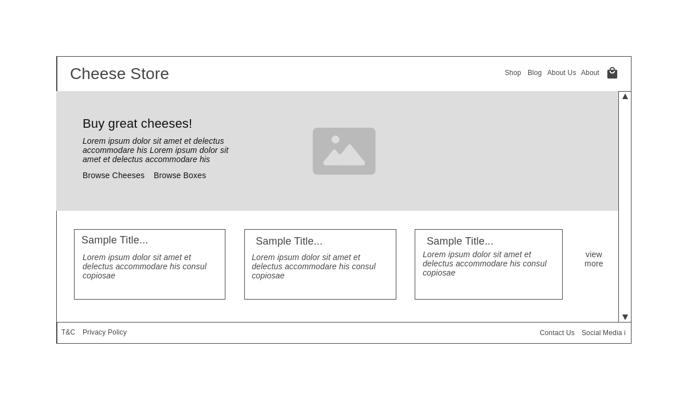

Home Page Initial Mobile Wireframe

 

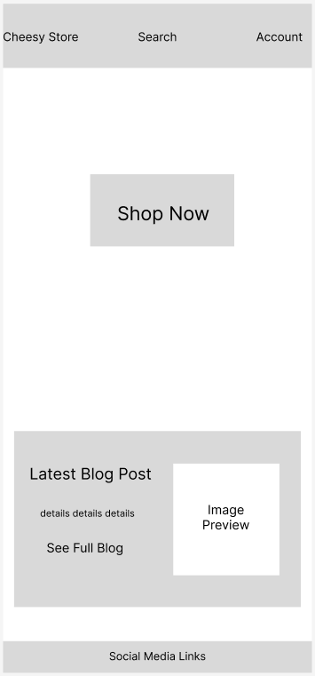

Product Page Initial Desktop Wireframe

 

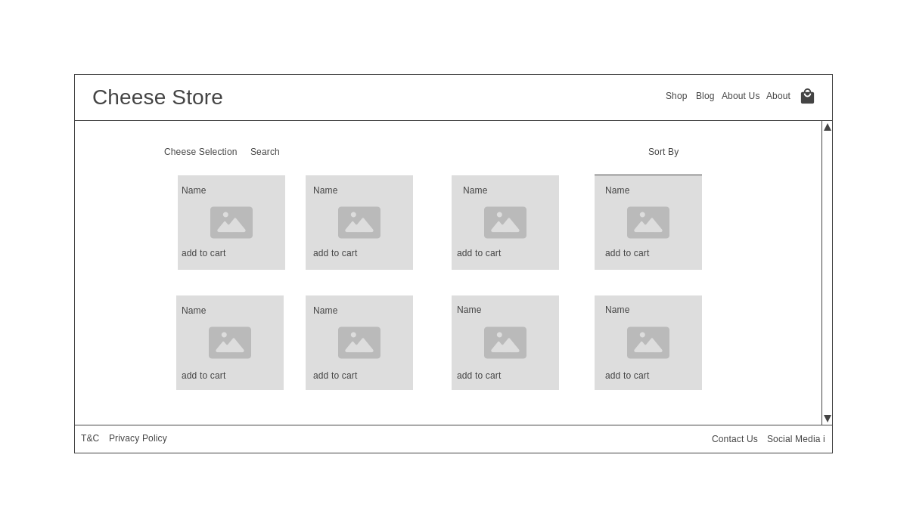

HProduct Page Initial Mobile Wireframe

 

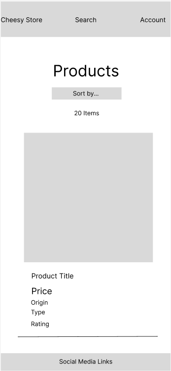

Product Page Initial Desktop Wireframe

 

Product Page Initial Mobile Wireframe

 

Product Page Initial Desktop Wireframe

 

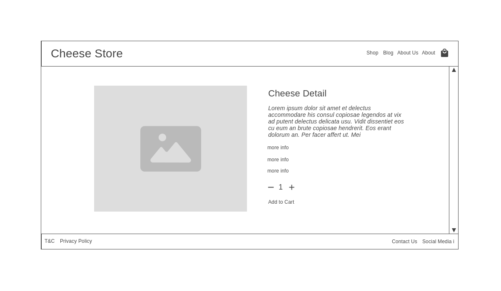

Product Page Initial Mobile Wireframe

 

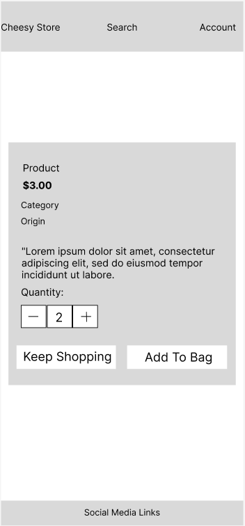

Bag Initial Desktop Wireframe

 

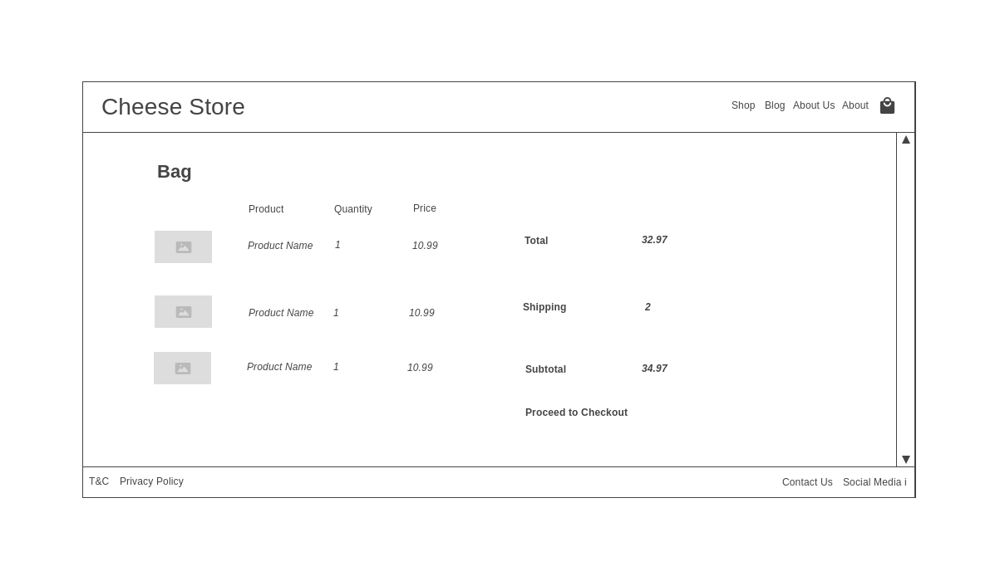

Bag Initial Mobile Wireframe

 

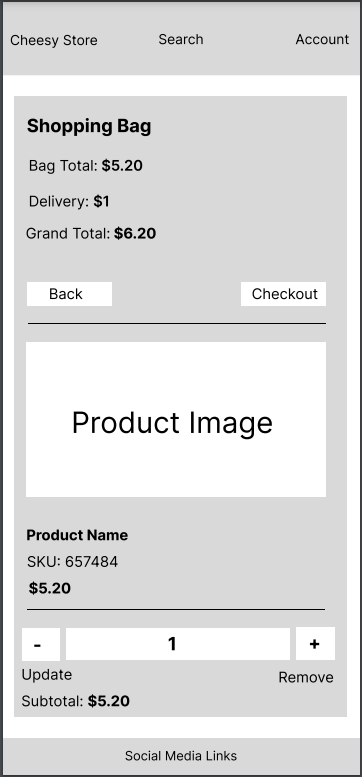

Checkout Initial Desktop Wireframe

 

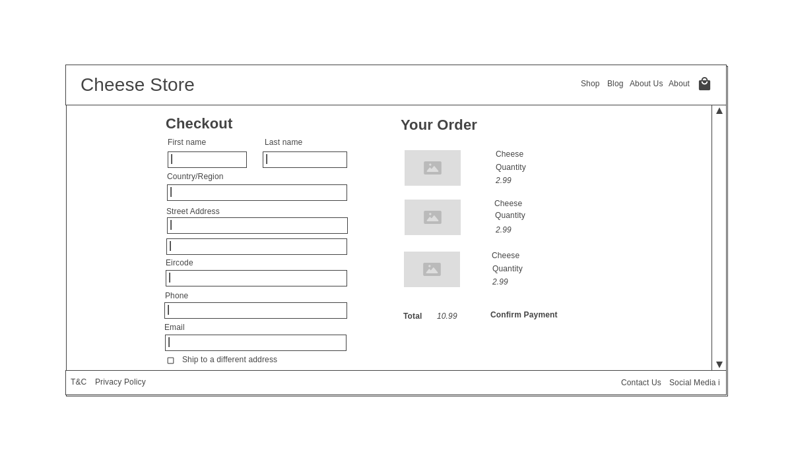

Checkout Initial Mobile Wireframe

 

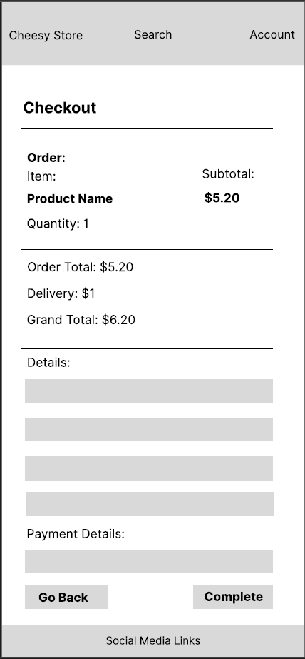

Blog Initial Desktop Wireframe

 

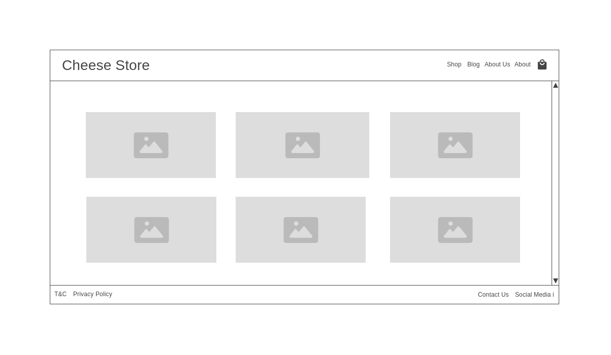

Blog Initial Mobile Wireframe

 

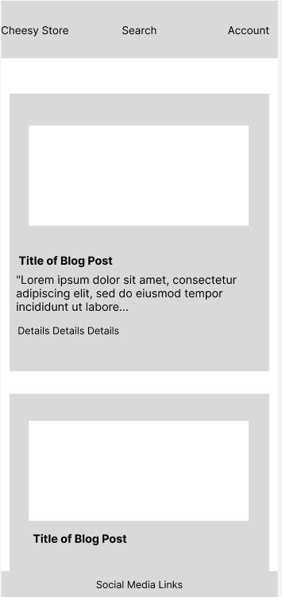

Blog Post Initial Mobile Wireframe

 

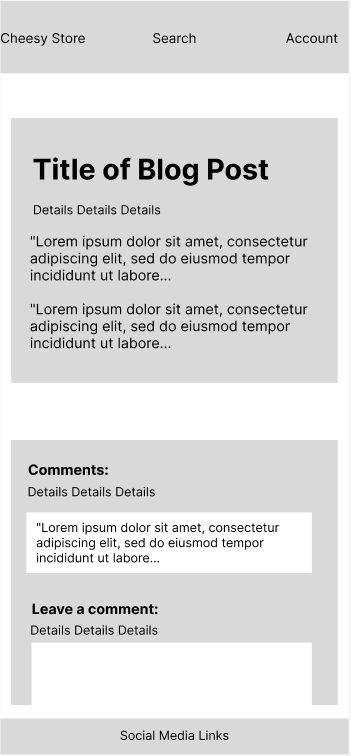

Contact Page Initial Desktop Wireframe

 

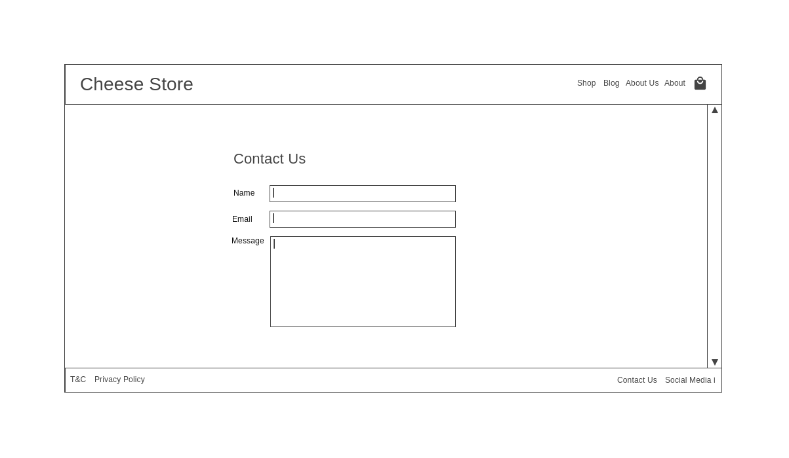

Contact Page Initial Mobile Wireframe

 

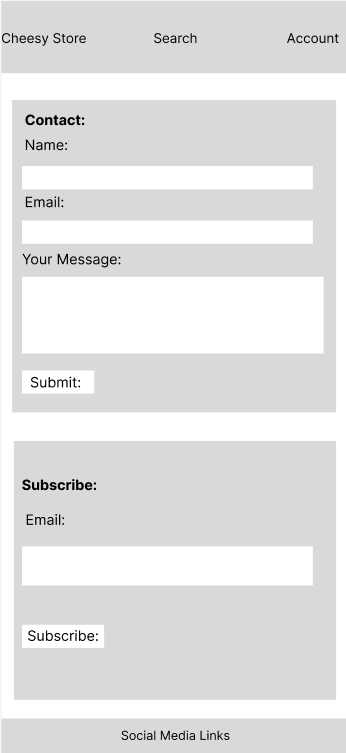

About Page Desktop Wireframe

 

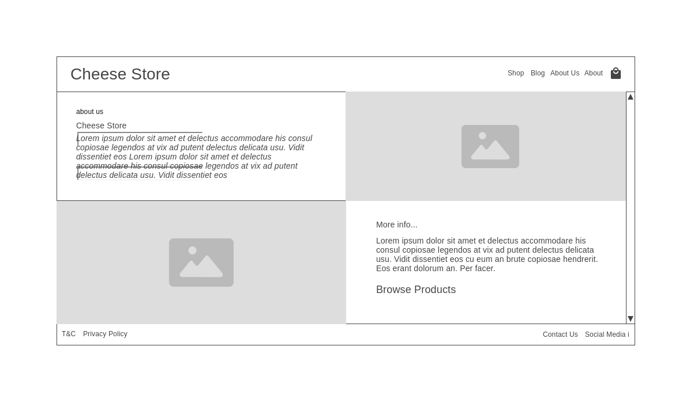

About Page Desktop Wireframe

 

FAQ Page Mobile Wireframe

 

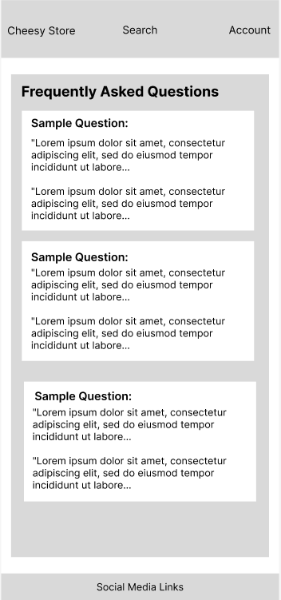

### Design

xxx

### GitHub Projects

In the repository for CheesyStore I opened some issues for this project. I began by creating sixteen User Story issues. I followed this by creating corresponding Tasks for each User Story. I created three different project and imported the User Stories into each project. 

- The main project board contains three columns: to do, in progress and completed. As development progressed I moved User Stories from one column to the next. This helped me keep track of what stage I was in during the project.

- I created a second project board and imported both the User Stories and Tasks to help me visualise what needed to be done for each User Story. Each User Story and corresponding Task is placed in a column.

- I created a third project board to help prioritise User Stories during development with MoSCoW Prioritisation with columns for Must-Have, Should-Have, Could-Have and Wont-Have.

Link to Main Project Board: [Project Board](https://github.com/users/chrisryan91/projects/10)

Link to User Stories + Tasks: [User Stories Board](https://github.com/users/chrisryan91/projects/11/views/1)

Link to MoSCoW Prioritisation Board: [MoSCoW Board](https://github.com/users/chrisryan91/projects/12)

User Stories are tested in: [TESTING.md](TESTING.md)

xxx

 

### Database and Data Models

CheesyStore has four app folders with models. The **User** model is handled by Django AllAuth.

#### cheesystoreshop

This app contains five models. These models are for the products, the categories for the products and the rating of the products.

The **Product** model contains the information to store details of the product for sale. The origin, category, cheesetype and rating fields are linked with foreign keys to the others models in this folder:

- category
- cheesetype
- origin
- sku
- name
- description
- price
- rating
- in_stock
- image_url
- image

The main **Category** model is for the main category to place the product into:

- name
- friendly_name

The subcategory **Origin** model is for where the cheese comes from:

-  name
-  friendly_name

The second subcategory **CheeseType** is for the type of cheese it is:

- name
- friendly_name

The **Rating** model holds the User rating for the specific product.

- product
- user
- stars

#### cheesyblog 

This app contains two models. These models are the blog posts and the comments on the web applications blog.

The **Post** model is for the blog posts themselves to be written by a superuser or through django-admin:

- title
- slug
- author
- updated_on
- content
- featured_image
- excerpt
- created_on
- status
- keywords

The **Comment** model is the comments on the blog posts. It is linked to the Post model and User model through foreign keys:

- post
- user
- body
- created_on
- approved

#### checkout

This app contains two models. These models are for the Order and Order Line Items - or the products themselves in the order:

The **Order** model contains the information for each specific order including user, address, contact details and order number:

- order_number
- user_profile
- full_name
- email
- phone_number
- country
- postcode
- town_or_city
- street_address1
- street-address2
- county
- date
- delivery_cost
- order_total
- grand_total
- original_bag
- stripe_pid

The **OrderLineItem** model contains the products and the quantity of each in each order:

- order
- product
- quantity
- lineitem_total

#### profiles

This app contains the information for each User profile. The User model itself is handled by Django AllAuth but it is extended here to aid the creation of profiles for each user:

The **UserProfile** model contains information to display for each registered user:

- user
- default_phone_number
- default_street_address1
- default_street_address2
- default_town_or_city
- default_county
- default_postcode
- default_country

Data Model Diagram

 

## Features

### CRUD Functionality

#### Create

- Superusers can create products for the store through the Product Management link on the Navbar. This allows administrators to add new products into the shop. The product management link only appears to admins.

- Registered users can add comments to each of the blog posts. New blog posts are created by administrators through the Django admin panel

#### Read

- Any user of the website irrespective of registration status can see the new products, blog posts or comments posted once they have been published by the admin.

#### Update

- Once an administrator is logged in, a small edit button appears beneath the Product displayed on the Products page and Products Detail page. Once clicked, it brings up a new page with the ability to edit the products.

#### Delete

- Once an administrator is logged in, a small delete button appears beneath the Product displayed on the Products page and Products detail page. Once clicked, it brings up an Alert confirming the intent to delete the product.

- Similarly, a small delete button appears for signed in users below the comments they may have written. If clicked, it will bring up an Alert confirming the intent to delete the product.

### Authentication and Authorisation

**Django All Auth** is used for backend authentication:

- Users can create an account in the sign-up page.
- Users can sign-in to their account to leave comments, posts and likes using the sign-in page.
- Users can login back into their account using the login page.
- Only authorised users can visit the submit review page and update review page.

### Navigation

xxx

Larger Navbar

 

Smaller Navbar

 

Footer

 

### Homepage

Homepage

 

### Page 1 etc.

xxx

 

Search Results

 

### Features Left to Implement

1. I want to use ChatGPT API to create a chatbot for users of my store to use to help make purchases and navigate the store. I initially made a User Story that remains unfinished: *As a potential customer, I want to interact with a chatbot on the cheese-selling website so that I can receive personalized recommendations, get answers to my questions about the products, and have assistance throughout the checkout process, making my shopping experience smoother and more enjoyable.*
2. 

## Technologies Used

### Core Development Technologies

- [Django](https://www.djangoproject.com/) was used a full-stack framework.
- [JavaScript](https://ecma-international.org/publications-and-standards/standards/ecma-262/)
- [jQuery](https://jquery.com/)
- [CSS](https://www.w3.org/Style/CSS/Overview.en.html)
- [HTML](https://html.spec.whatwg.org/multipage/)
- [Django Templating Language](https://docs.djangoproject.com/en/4.2/ref/templates/language/) for building pages

### Libraries, Frameworks and Packages

- [Bootstrap](https://getbootstrap.com/)

### Python/Django packages

- [Gunicorn](https://pypi.org/project/gunicorn/)
- [psycopg2](https://pypi.org/project/psycopg2/)
- [crispy_forms](https://django-crispy-forms.readthedocs.io/en/latest/)
- [django_summernote](https://pypi.org/project/django-summernote/)
  
### Infrastructural Technologies

- [PostgreSQL](https://www.postgresql.org/)
- [Heroku](https://www.heroku.com/home)
- [Cloudinary](https://cloudinary.com/)

## Testing

Full testing: [Testing.md](TESTING.md)

## Deployment 

### Local Deployment

xxx

### Heroku 

xxx

### Environment Variables

xxx

## Credits

xxx
