# CheesyStore

Welcome to CheesyStore, an online cheesemonger based in Ireland. Our website offers a handpicked selection of the finest cheeses from Ireland and around the world. CheesyStore goes beyond just selling cheese. Alongside the shop there is a blog featuring pairing guides, the stories behind our products, and the latest news from the dairy world. These insights, along with special offers, are shared across various social media platforms to keep our community engaged and informed.

CheesyStore is a B2C e-commerce store and blog. The site is targeted towards potential customers both in Ireland and internationally. The payment system uses Stripe. 

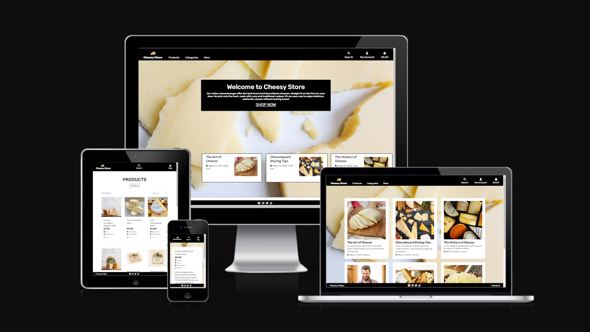

Live Website here: [Cheesy Store](http://cheesystore-191ae9e3f358.herokuapp.com/)

Link to Main Project Board: [Project Board](https://github.com/users/chrisryan91/projects/10)

## Table of Contents
- [CheesyStore](#cheesystore)
  - [Table of Contents](#table-of-contents)
  - [Concept](#concept)
  - [Development](#development)
    - [User Stories](#user-stories)
    - [Design](#design)
      - [Color Scheme](#color-scheme)
      - [Imagery](#imagery)
      - [Fonts](#fonts)
    - [Wireframes](#wireframes)
    - [GitHub Projects](#github-projects)
    - [Database and Data Models](#database-and-data-models)
      - [cheesystoreshop](#cheesystoreshop)
        - [Product](#product)
        - [Category](#category)
        - [Origin](#origin)
        - [CheeseType](#cheesetype)
        - [Rating](#rating)
      - [cheesyblog](#cheesyblog)
        - [Post](#post)
        - [Comment](#comment)
      - [checkout](#checkout)
        - [Order](#order)
        - [OrderLine Item](#orderline-item)
      - [profiles](#profiles)
        - [User Profile](#user-profile)
      - [Database Model Diagram](#database-model-diagram)
  - [Features](#features)
    - [CRUD Functionality](#crud-functionality)
      - [Create](#create)
      - [Read](#read)
      - [Update](#update)
      - [Delete](#delete)
    - [Authentication and Authorisation](#authentication-and-authorisation)
    - [Navigation](#navigation)
    - [Homepage](#homepage)
    - [CheesyStoreShop](#cheesystoreshop-1)
    - [Product Detail](#product-detail)
    - [Cheesy Blog](#cheesy-blog)
    - [Cheesy Blog Posts](#cheesy-blog-posts)
    - [Bag](#bag)
    - [Checkout](#checkout-1)
    - [Frequently Asked Questions](#frequently-asked-questions)
    - [Contact Us](#contact-us)
    - [Success Page](#success-page)
    - [Product Management](#product-management)
    - [My Profile](#my-profile)
    - [Sign In](#sign-in)
    - [Footer](#footer)
    - [Features Left to Implement](#features-left-to-implement)
  - [Business Model](#business-model)
  - [Web Marketing and Search Engine Optimisization](#web-marketing-and-search-engine-optimisization)
    - [Key Words](#key-words)
    - [Blog Keywords](#blog-keywords)
    - [Sitemap and Robots.txt](#sitemap-and-robotstxt)
    - [Social Media Marketing](#social-media-marketing)
    - [Email Marketing](#email-marketing)
  - [Technologies Used](#technologies-used)
    - [Core Development Technologies \& Languages](#core-development-technologies--languages)
  - [Testing](#testing)
  - [Deployment - Heroku](#deployment---heroku)
    - [Create the Heroku App:](#create-the-heroku-app)
    - [Attach the Postgres database:](#attach-the-postgres-database)
    - [Update Heroku Config Vars](#update-heroku-config-vars)
    - [Deploy](#deploy)
  - [AWS Set Up](#aws-set-up)
    - [AWS S3 Bucket](#aws-s3-bucket)
    - [IAM](#iam)
    - [Connecting S3 to Django](#connecting-s3-to-django)
  - [Forking this repository](#forking-this-repository)
  - [Cloning this repository](#cloning-this-repository)
  - [Credits](#credits)

## Concept

This web application is a submission for Portfolio Project 5, with a focus on e-commerce. The project required a concept that could process payments using Stripe and be marketable on social media platforms. The chosen concept is an online cheesemonger, which offers a variety of cheese products. The website is designed to cater to a wide audience and is structured for easy categorization of products.

To enhance marketing efforts and attract customers, the website includes a blog. The blog allows the site owners to publish posts related to cheese products, history, and culture. This feature aims to engage visitors and provide additional value beyond just e-commerce.

The current version of the website is a Minimum Viable Product (MVP), developed within the project's deadline constraints. Future expansions are planned to include features such as recipes, pairing guides, and an integrated chatbot using the ChatGPT API. These additions are intended to further enhance the user experience and the website's offerings.

## Development

### User Stories

1. As a site administrator, I can manage user accounts, including activating, deactivating, and deleting accounts, so that I can maintain the site's user base and security.
2. As a site user, I can subscribe to the newsletter to receive updates on new cheese arrivals, promotions, and blog posts so that I can stay informed.
3. As a site user, I can read blog posts about cheese tasting, pairing tips, and cheese-making processes so that I can expand my knowledge and appreciation of cheese.
4. As a site user, I can leave comments and reviews on cheeses and blog posts so that I can share my opinions and experiences with other users.
5. As a site administrator, I can create and publish blog posts about cheese-related topics so that I can engage users and attract traffic to the site.
6. As a site administrator, I can add, edit, and delete cheeses from the store inventory so that I can manage the product catalog.
7. As a site user, I can create an account and log in so that I can track my order history and manage my profile information.
8. As a site user, I can view detailed information about each cheese, including its origin, flavor profile, and suggested pairings, so that I can make an informed decision.
9. As a site user, I can search for specific types of cheeses (e.g., soft, hard, aged) so that I can find cheeses that match my preferences.
10. As a site user, I can add cheeses to my cart and proceed to checkout so that I can purchase them.
11. As a site user, I can browse a variety of cheeses so that I can explore different options.
12. As a user, I want to be able to set up an account and login in and log out so I can purchase items and leave a comment.
13. As a user, I want to easily find answers to frequently asked questions so that I can make informed decisions about the products and policies without needing to wait for a response from customer service.
14. As a user, I want to subscribe to a monthly cheese subscription service so that I can discover new cheeses and have a consistent supply of high-quality cheese without having to reorder manually each time.
15. As a user, I want to participate in a loyalty program that rewards me for my purchases so that I can enjoy discounts, get early access to new products, and access exclusive content.
16. As a potential customer, I want to interact with a chatbot on the cheese-selling website so that I can receive personalized recommendations, get answers to my questions about the products, and have assistance throughout the checkout process, making my shopping experience smoother and more enjoyable.

User Stories are tested in: [TESTING.md](TESTING.md)

Link to User Stories + Tasks: [User Stories Board](https://github.com/users/chrisryan91/projects/11/views/1)

### Design

#### Color Scheme

#### Imagery

CheesyStore contains a background image that is present on most of the pages on the site. It is from Pexels.com and it is called "Slice Cheese, Biscuits and Bowl of Fruits". I chose it because the centre of the image is blank which would have been nice for a call to action. A link can be found [here](https://www.pexels.com/photo/slice-cheese-biscuits-and-bowl-of-fruits-543733/).

#### Fonts

For CheesyStore, I selected the Rubik font due to its versatility. Being a sans-serif typeface, it's excellent for headings and titles. For body text or more extensive sections of text, I opted for the Lora font. Its readability paired well with Rubik so it was an ideal choice.

Links: [Rubik](https://fonts.google.com/specimen/Rubik?query=rubik) and [Lato](https://fonts.google.com/specimen/Lato?query=lato).

### Wireframes


Wireframes were created at the start of the project to establish the website's structure. The initial framework has largely stayed consistent throughout the development process. These wireframes were used as a reference for the design, ensuring that it did not stray significantly from the intended direction. They were also designed with responsiveness in mind, knowing that Bootstrap could be used to adapt the layout for smaller screens.

Although there were some deviations from the original design, such as not including an "About Us" section, I made efforts to adhere to the initial wireframe as closely as possible. The wireframes proved to be valuable, providing a solid foundation for the design. They helped prevent excessive deviation during the styling process, which often led to cluttered HTML and CSS.

<details>
<summary>Home Page Initial Desktop Wireframe</summary>
<br>


</details>

<details>
<summary>Home Page Initial Mobile Wireframe</summary>
<br>


</details>

<details>
<summary>Product Page Initial Desktop Wireframe</summary>
<br>


</details>

<details>
<summary>Product Page Initial Mobile Wireframe</summary>
<br>


</details>

<details>
<summary>Product Page Initial Desktop Wireframe</summary>
<br>


</details>

<details>
<summary>Product Page Initial Mobile Wireframe</summary>
<br>


</details>

<details>
<summary>Product Page Initial Desktop Wireframe</summary>
<br>


</details>

<details>
<summary>Product Page Initial Mobile Wireframe</summary>
<br>


</details>

<details>
<summary>Bag Initial Desktop Wireframe</summary>
<br>


</details>

<details>
<summary>Bag Initial Mobile Wireframe</summary>
<br>


</details>

<details>
<summary>Checkout Initial Desktop Wireframe</summary>
<br>


</details>

<details>
<summary>Checkout Initial Mobile Wireframe</summary>
<br>


</details>

<details>
<summary>Blog Initial Desktop Wireframe</summary>
<br>


</details>

<details>
<summary>Blog Initial Mobile Wireframe</summary>
<br>


</details>

<details>
<summary>Blog Post Initial Mobile Wireframe</summary>
<br>


</details>

<details>
<summary>Contact Page Initial Desktop Wireframe</summary>
<br>


</details>

<details>
<summary>Contact Page Initial Mobile Wireframe</summary>
<br>


</details>

<details>
<summary>About Page Desktop Wireframe</summary>
<br>


</details>

<details>
<summary>About Page Desktop Wireframe</summary>
<br>


</details>

<details>
<summary>FAQ Page Mobile Wireframe</summary>
<br>


</details>

### GitHub Projects

In the repository for CheesyStore, I initiated the project by creating sixteen User Story issues. Subsequently, I generated corresponding Tasks for each User Story. Three different project boards were created, and the User Stories were imported into each.

1. The main project board comprises three columns: to do, in progress, and completed. As development advanced, I transitioned User Stories from one column to another, aiding in tracking the project's progress.

2. A second project board was created, incorporating both User Stories and Tasks. This board was designed to provide an overview of the tasks associated with each User Story, with each User Story and its corresponding Task placed in a specific column.

3. A third project board was created to prioritize User Stories using the MoSCoW Prioritization method. This board featured columns for Must-Have, Should-Have, Could-Have, and Won't-Have, facilitating the prioritization of development tasks.

Link to Main Project Board: [Project Board](https://github.com/users/chrisryan91/projects/10)

Link to User Stories + Tasks: [User Stories Board](https://github.com/users/chrisryan91/projects/11/views/1)

Link to MoSCoW Prioritisation Board: [MoSCoW Board](https://github.com/users/chrisryan91/projects/12)

User Stories are tested in: [TESTING.md](TESTING.md)

### Database and Data Models

CheesyStore has four app folders with models. The **User** model is handled by Django AllAuth.

#### cheesystoreshop

This app contains five models. These models are for the products, the categories for the products and the rating of the products.

##### Product

The Product model contains the information to store details of the product for sale. The origin, category, cheesetype and rating fields are linked with foreign keys to the others models in this folder in a one-to-many relationship. The rating model is linked to the Product model but in a many-to-one relationship.

1. category (Foreign Key, Category)
2. cheesetype (Foreign Key, CheeseType)
3. origin (Foreign Key, Origin)
4. sku
5. name
6. description
7. price
8. rating
9. in_stock
10. image_url
11. image

#####  Category

The main Category model is for the main category to place the product into:

1. name
2. friendly_name

##### Origin

The subcategory Origin model is for where the cheese comes from:

1. name
2. friendly_name

##### CheeseType

The second subcategory CheeseType is for the type of cheese it is:

1. name
2. friendly_name

##### Rating

The Rating model holds the User rating for the specific product.

1. product (Foreign Key, Product)
2. user
3. stars

#### cheesyblog 

This app contains two models. These models are the blog posts and the comments on the web applications blog. There is a many-to-one relatiionship between post and user, comment and post, and comment and user.

##### Post

The Post model is for the blog posts themselves to be written by a superuser or through django-admin:

1. title
2. slug
3. author (Foreign Key, User)
4. updated_on
5. content
6. featured_image
7. excerpt
8. created_on
9. status
10. keywords

##### Comment

The Comment model is the comments on the blog posts. It is linked to the Post model and User model through foreign keys:

1. post (Forign Key, Post)
2. user (Foreign Key, User)
3. body
4. created_on
5. approved

#### checkout

This app contains two models. These models are for the Order and Order Line Items - or the products themselves in the order. There is a one-to-many relationship from UserProfile to Order, and Order to OrderLineItem. There is a many-to-one relationship between Product and OrderLineItem.

##### Order

The Order model contains the information for each specific order including user, address, contact details and order number:

1. order_number
2. user_profile (Foreign Key, User Profile)
3. full_name
4. phone_number
5. email
6. country
7. postcode
8. town_or_city
9. street_address1
10. street-address2
11. county
12. date
13. delivery_cost
14. order_total
15. grand_total
16. original_bag
17. stripe_pid

##### OrderLine Item

The OrderLineItem model contains the products and the quantity of each in each order:

1. order (Foreign Key, Order)
2. product (Foreign Key, Product)
3. quantity
4. lineitem_total

#### profiles

This app contains the information for each User profile. The User model itself is handled by Django AllAuth but it is extended here to aid the creation of profiles for each user:

##### User Profile

The UserProfile model contains information to display for each registered user. There is a one-to-one relationship between UserProfile and User.

1. user (Foreign Key, User)
2. default_phone_number
3. default_street_address1
4. default_street_address2
5. default_town_or_city
6. default_county
7. default_postcode
8. default_country

#### Database Model Diagram

I created this Database Diagram Model with DrawSQL.

<details>
<summary>Data Model Diagram</summary>
<br>


</details>

## Features

### CRUD Functionality

#### Create

- Superusers can add new products to the store via the "Product Management" link in the Navbar. This feature is only for administrators, allowing them to update the shop's inventory. The "Product Management" link is visible only to admins.

- Registered users have the ability to post comments on blog entries. Administrators can create new blog posts through the Django admin panel.

#### Read

- Any user of the website irrespective of registration status can see the new products, blog posts or comments posted once they have been approved and posted by the admin.

#### Update

- Administrators, once logged in, will see a small "edit" button beneath each product listing on the "Products" page and the "Product Detail" page. Clicking this button directs them to a page where they can modify the product details. Similarly, a comment can be edited by bringing up a seperate HTML page for editing a comment. 

#### Delete

- Administrators, once logged in, will notice a small "delete" button beneath each product listing on the "Products" page and the "Product Detail" page. Clicking this button triggers a form with text beneath the button to confirm the deletion of the product.

- Similarly, registered users will see a "delete" button below their comments. Clicking this button triggers a form with text beneath the button to confirm the deletion of the comment.

### Authentication and Authorisation

**Django All Auth** is used for backend authentication:

- Users can create an account in the sign-up page.
- Users can sign-in to their account to leave comments, posts and likes using the sign-in page.
- Users can login back into their account using the login page.
- Only authorised users can visit the submit review page and update review page.

### Navigation

On larger screens, the navigation bar contains tabs aligned to the right and aligned to the left. On the right, there is an icon for the store which serves as link to the homepage. It is followed by links to three dropdown icons for Products, Categories and More. By clicking Product we find links All Products, Cheeses and Other Products. By clicking Categories we find links the products in the store categorised by Cheese Type and Origin. By clicking More we find links to the FAQ, Contact and Blog Page. 

On the left of the navigation bar, two dropdown icons and a link. The two dropdown links are for Search and My Account. By clicking Search, a dropdown appears with a Form to search the products in the store. By clicking My Account, links to login, register, sign-out and my profile appear. A further Product Management link appears if the user is a Superuser. The final link is a link to the Bag page contains products selected to purchase.

On smaller screens, the Navigation bar responds by turning the Icon into another Dropdown Menu. Remaining on the mobile Navigation bar are Search and Bag icons which have the same functionality as on Desktop. The CheesyStore Icon Dropdown menu contains all the other links from the Desktop navigation bar including a Home and My Account link.

<details>
<summary>Desktop Navbar</summary>
<br>

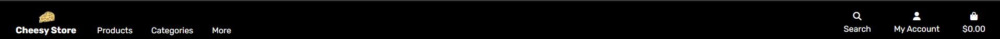
</details>

<details>
<summary>Mobile Navbar</summary>
<br>

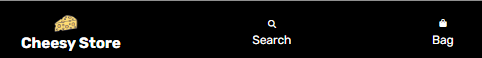
</details>

<details>
<summary>Mobile Navbar Dropdown</summary>
<br>

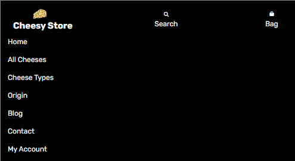
</details>

### Homepage


The Homepage is structured into three sections. The top section features a "Welcome" message alongside a brief description of the Store, accompanied by a "Shop Now" button designed as a prompt for visitors to explore the store further. The middle section displays three thumbnails, each linking to one of the three most recent blog posts. The inclusion of a new blog post dynamically refreshes this section to showcase the latest content. On devices with smaller screens, the display adjusts to highlight just a single post. The bottom section is divided into two parts: the first part highlights the most recent addition to the store's product range, and the second part provides a subscription form for the mailing list. When viewed on smaller screens, these parts stack vertically.

<details>
<summary>Desktop Homepage</summary>
<br>

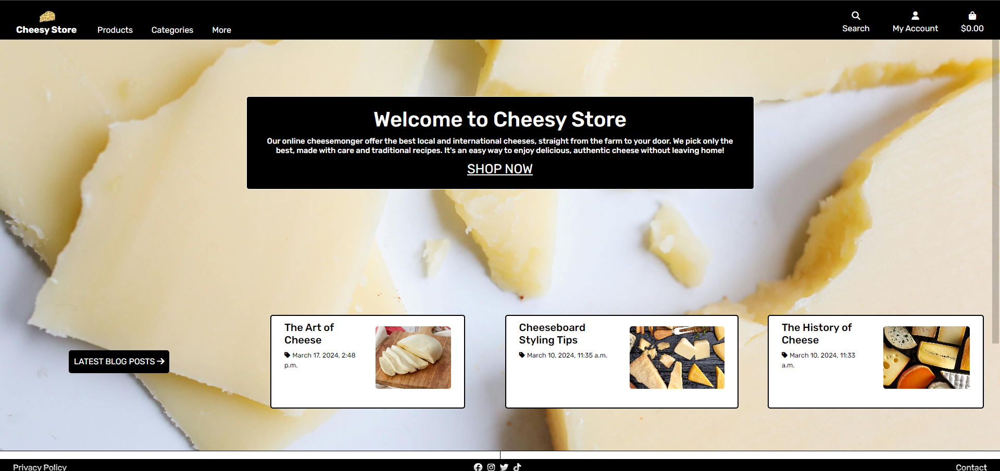
</details>

<details>
<summary>Mobile Homepage</summary>
<br>

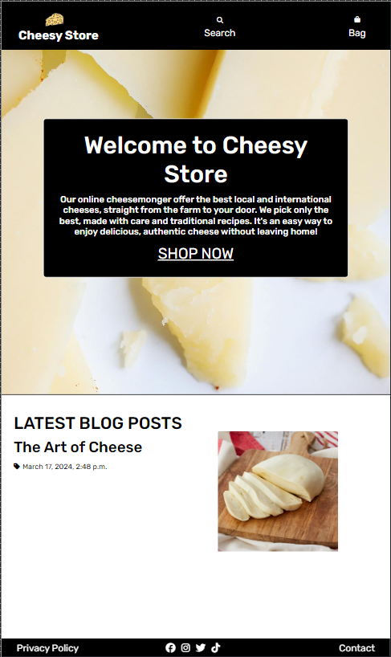
</details>

### CheesyStoreShop

The products page layout remains consistent across all product categories, with products organized in rows. The number of products displayed per row varies with screen size: six products are shown per row on the largest screens, while only one product is displayed on the smallest screens. Each product card features an image, name, price, origin, cheese type, and rating. For administrators, additional "Edit" and "Delete" buttons are available for each product for easy management. The content is divided into multiple pages through pagination.

<details>
<summary>Cheesy Store Shop Desktop</summary>
<br>

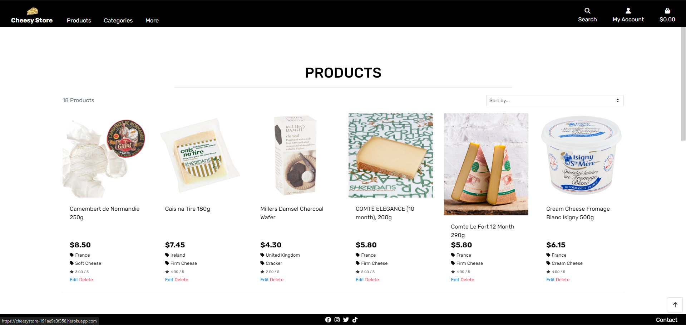
</details>

<details>
<summary>Cheesy Store Shop Mobile</summary>
<br>

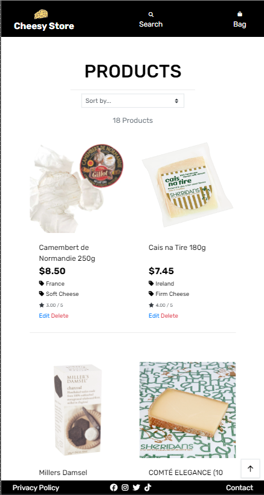
</details>

### Product Detail

The product details page is designed with two-columns. On one side, there's a large image of the featured product. The opposite column displays the same product information found on the main store page, including specifics like name, price, origin, cheese type, and rating, along with a short product description. For users who are logged in, there's an option to rate the product with up to five stars. Below the rating, a quantity selector allows users to adjust how many units they wish to purchase, using plus and minus buttons for adjustment. The page concludes with two action buttons: one to continue shopping and another to add the selected product quantity to the shopping bag. On smaller screen sizes, the large image of the product will not display.

<details>
<summary>Product Detail Desktop</summary>
<br>

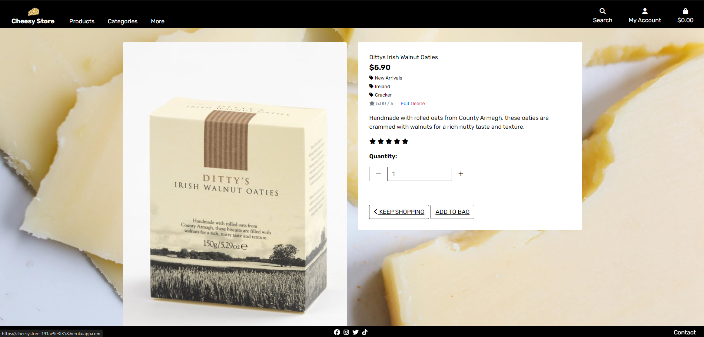
</details>

<details>
<summary>Product Detail Mobile</summary>
<br>

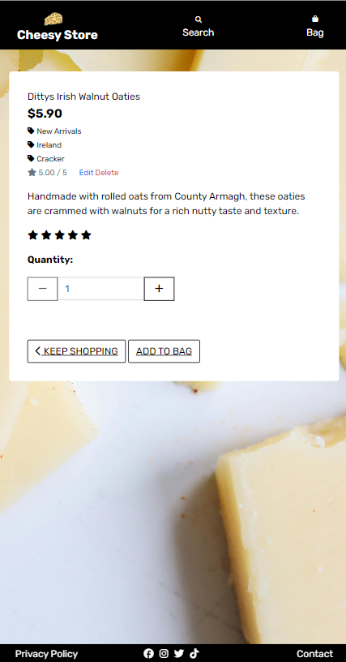
</details>

### Cheesy Blog

The Blog section mirrors the store's design, organizing blog posts into rows of cards. Each card displays a featured image and an excerpt from the blog post, as well as the time and date it was submitted. To facilitate easier navigation, the blog pages are also paginated. On smaller screen sizes, the blog posts will display as a single column.

<details>
<summary>Cheesy Blog Desktop</summary>
<br>

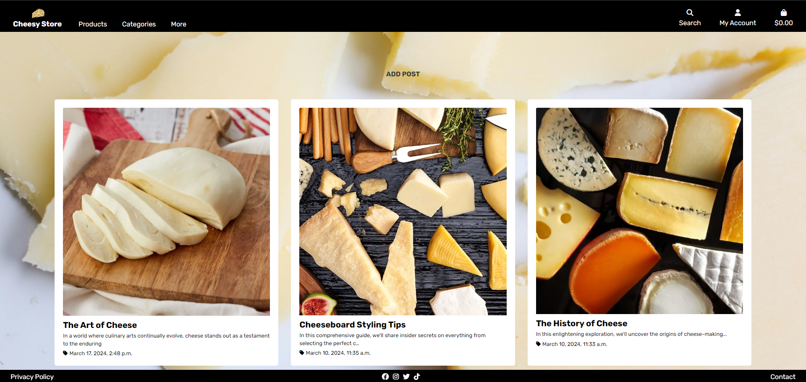
</details>

<details>
<summary>Cheesy Blog Mobile</summary>
<br>

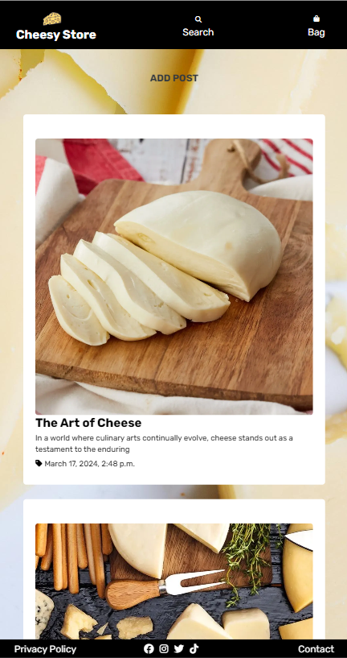
</details>

### Cheesy Blog Posts

The layout for viewing individual blog posts is designed similarly to the product details page. The first part is divided into two columns: one for the main text of the blog post and another for the featured image. On smaller screens, the featured image is designed to be hidden for viewing space. The second part of the layout is dedicated to user interactions, specifically comments. It's split into two sections: one displaying existing comments and the other featuring a form for submitting new comments. Beneath each comment, "Edit" and "Delete" buttons are provided, visible only to the comment's author. On smaller screens, these two sections stack vertically.

<details>
<summary>Blog Post Desktop</summary>
<br>

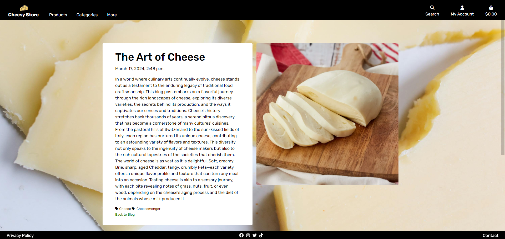
</details>

<details>
<summary>Blog Post Mobile</summary>
<br>

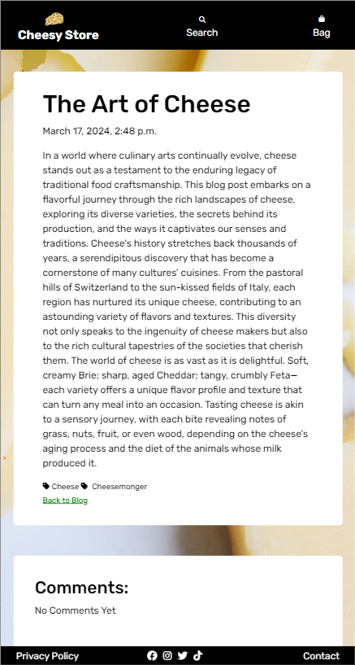
</details>

### Bag

The bag page features a table listing all the items added by the user. Each product has a separate row within the table, with columns to display the product's image, title, price, quantity, and subtotal. The quantity column includes a form for each product, allowing users to either remove the product or adjust its quantity. The final row of the table presents the grand total of the items in the bag, accompanied by two links: one to "Keep Shopping" and another to "Continue to Checkout." For better readability on smaller screens, the table layout shifts to a single-column, where each section presents the product's image, details, and the quantity adjustment form.

<details>
<summary>Bag Desktop</summary>
<br>

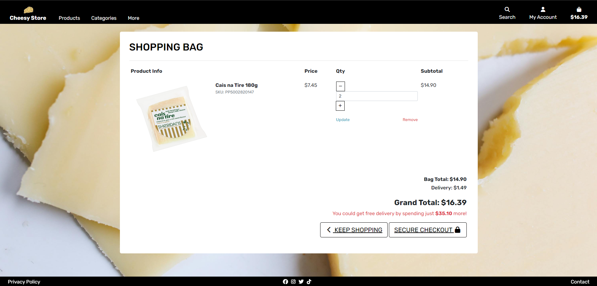
</details>

<details>
<summary>Bag Mobile</summary>
<br>

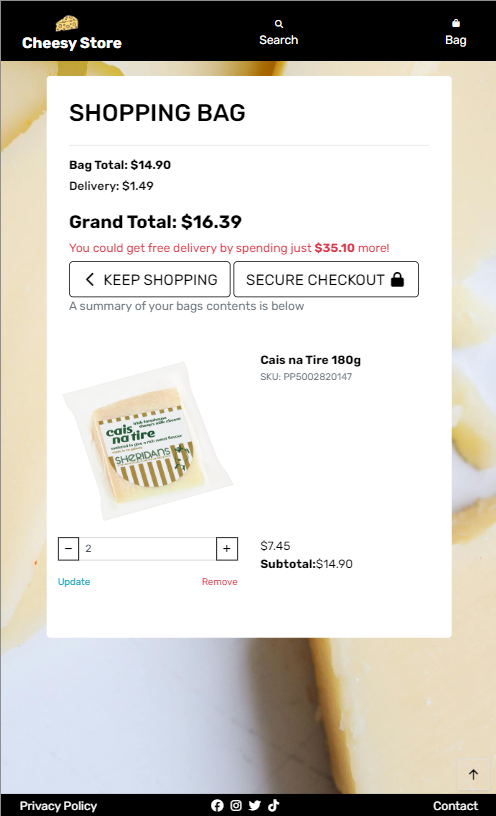
</details>

### Checkout

The checkout page is divided into two main sections. On the left side, there is a summary of the order, providing an overview of the items selected for purchase. On the right side, users are presented with a form to enter their personal and shipping details, as well as a separate section designated for entering payment information i.e card details. For users who are logged in, the form fields for personal and shipping information are automatically populated with their stored details, streamlining the checkout process. These two sections stack vertically on smaller screen sizes.

<details>
<summary>Contact Desktop</summary>
<br>

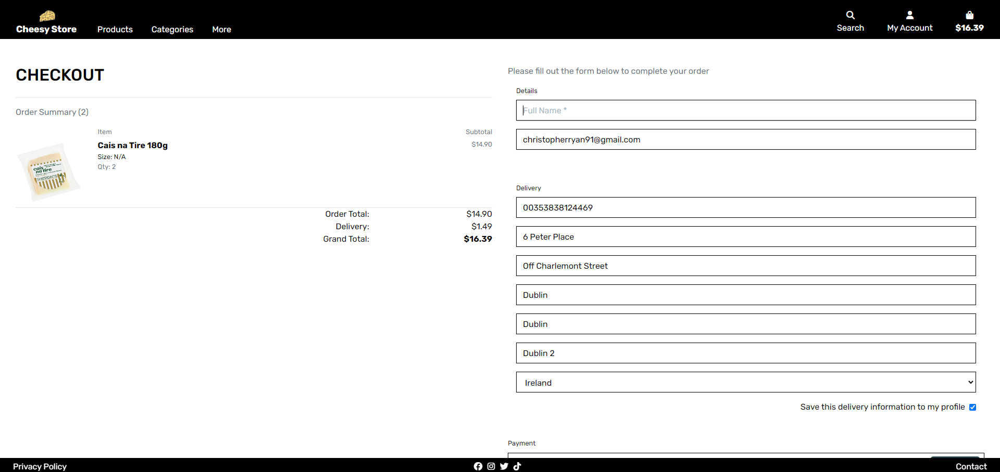
</details>

<details>
<summary>Contact Mobile</summary>
<br>

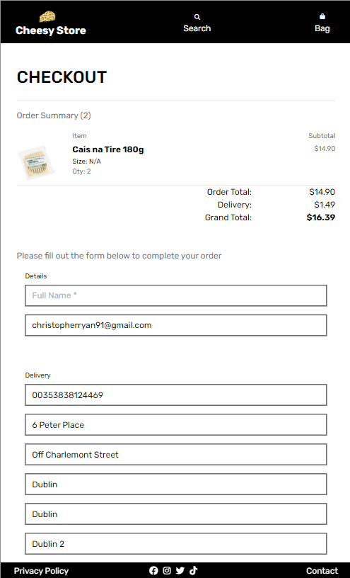
</details>

### Frequently Asked Questions

The Frequently Asked Questions (FAQ) Page is organized with a single, centrally aligned column that groups each question with its relevant answer. This layout facilitates easy navigation and readability, allowing users to quickly find the information they need.

<details>
<summary>FAQ Desktop</summary>
<br>

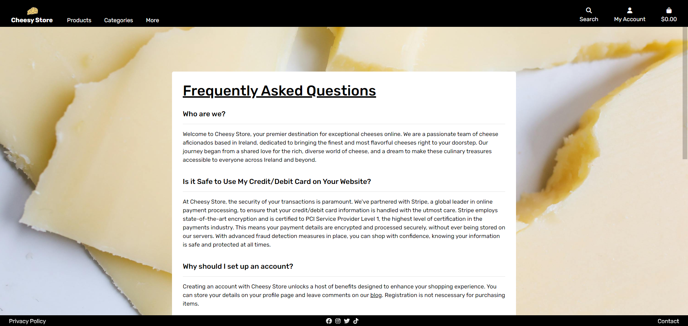
</details>

<details>
<summary>FAQ Mobile</summary>
<br>


</details>

### Contact Us

The "Contact Us" page is split into two distinct sections. The first section features a form where users can fill out their name, email, and the message they wish to send to the administrators for various purposes. The second section includes the subscription form that is also found on the homepage, allowing users to subscribe to newsletters or updates directly from the "Contact Us" page. This dual-section setup serves both communication and engagement purposes on the same page.

<details>
<summary>Contact Us Desktop</summary>
<br>

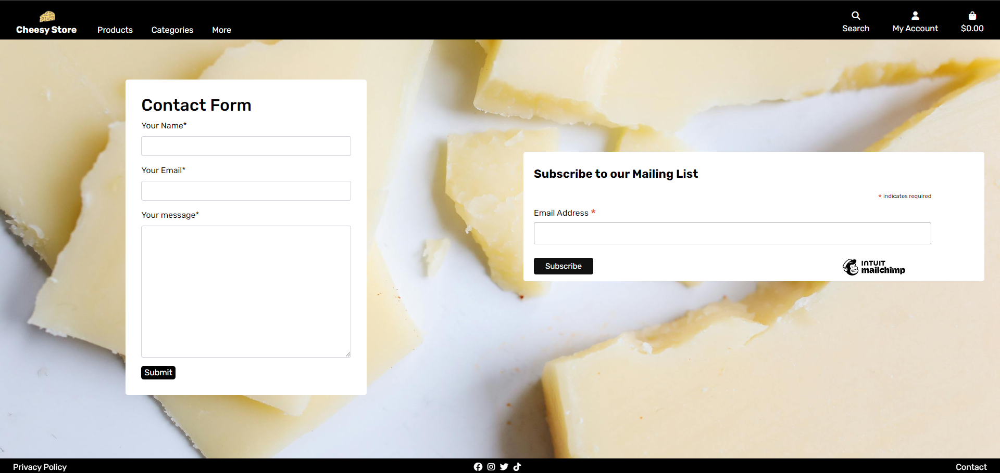
</details>

<details>
<summary>Contact Us Mobile</summary>
<br>

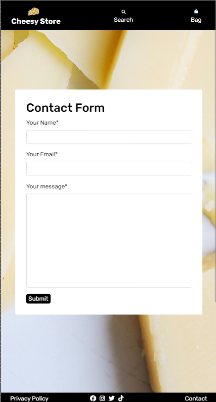
</details>

### Success Page

The success page displays an order summary for the user, providing details about their purchase. This summary includes the order number, the date of the order, and information regarding the shipping details. This layout ensures users have a clear confirmation of their transaction, including when and where their order will be shipped.

<details>
<summary>Success Desktop</summary>
<br>

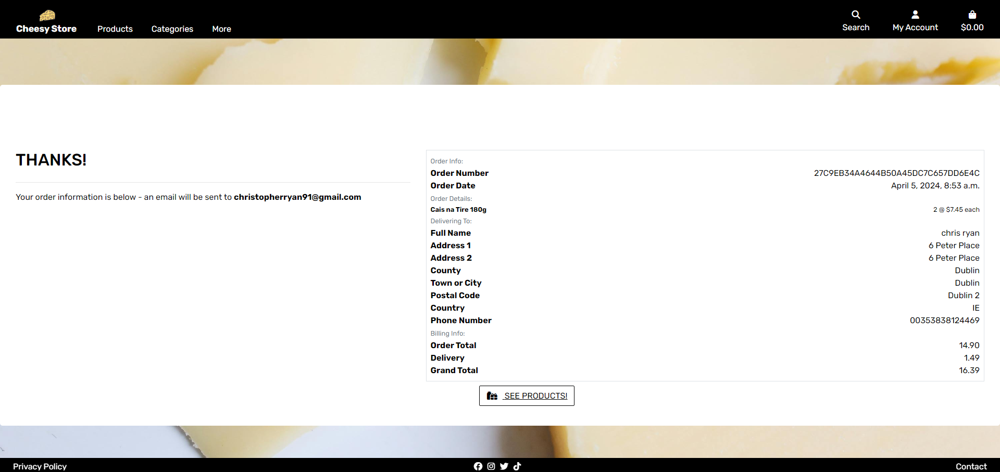
</details>

<details>
<summary>Success Mobile</summary>
<br>

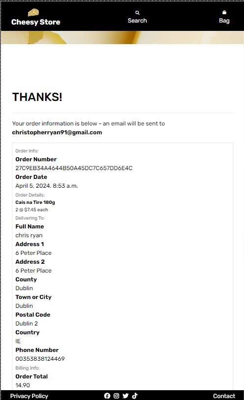
</details>

<details>
<summary>Success Toast</summary>
<br>

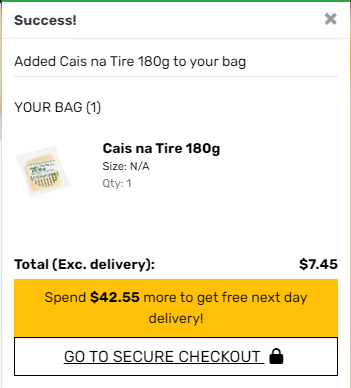
</details>

### Product Management

The Product Management page features a comprehensive form designed for entering the details of new products, including an option to upload an image. The form incorporates dropdown menus, allowing for the selection of categories under which the new products will be placed. This setup facilitates organized product addition, ensuring each item is correctly categorized for easy browsing and management.

<details>
<summary>Product Management Page</summary>
<br>

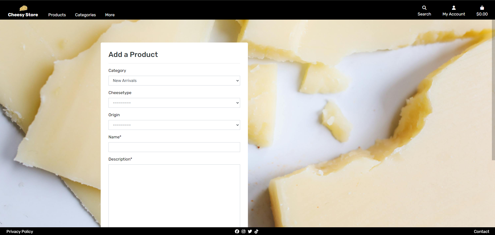
</details>

### My Profile

The profile page is divided into two main sections to enhance user experience. The first section lists all orders associated with the user. Each listed order includes a link to the relevant checkout success page. The second section of the profile page presents a form for updating the Default Delivery Information. This form includes fields for users to input or amend their standard shipping details.

<details>
<summary>Profile Page</summary>
<br>

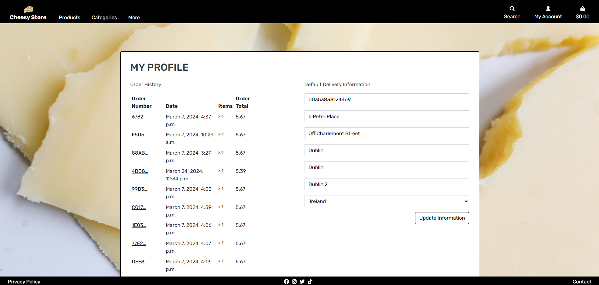
</details>

### Sign In

The Sign In page features a straightforward design, with a form that's centrally aligned for ease of use. This form contains fields for entering a Login and Password. Pages for registration, password recovery, and displaying errors follow a similar design ethos, ensuring a consistent and user-friendly experience.

<details>
<summary>Sign In Page</summary>
<br>

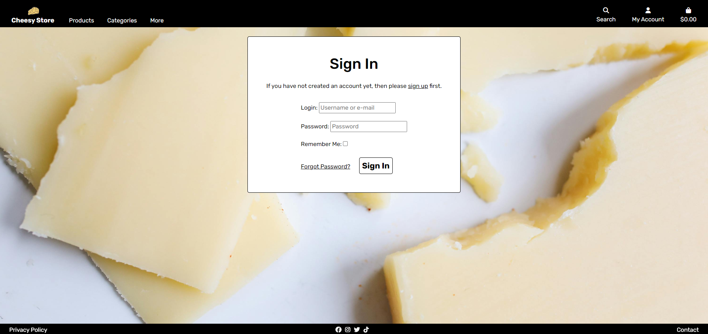
</details>

### Footer

In the footer a link to the store's Privacy Policy is aligned to the right. In the center, social media links are displayed, offering a way for users to connect with the store. Also rightly aligned is a link to the Contact Page. On smaller screen sizes, the design simplifies to display only the social media links.

<details>
<summary>Footer</summary>
<br>

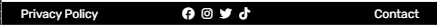
</details>

### Features Left to Implement

1. I want to use ChatGPT API to create a chatbot for users of my store to use to help make purchases and navigate the store. I initially made a User Story that remains unfinished: *As a potential customer, I want to interact with a chatbot on the cheese-selling website so that I can receive personalized recommendations, get answers to my questions about the products, and have assistance throughout the checkout process, making my shopping experience smoother and more enjoyable.*

## Business Model

Cheesy Store's Business Model is Business to Consumer (B2C). Products are sold directly from Cheesy Store to consumers who are the end-users.

A customer of Cheesy Store would be someone who is most likely an adult who is interested in cheese or cheese culture. The blog can potentially attract potential customers who may be interested in it's content. From there products can be marketed and the customer can be redirected to the store.

## Web Marketing and Search Engine Optimisization

### Key Words

I chose a mixture of shorttail and longtail keywords. I struggled to only pick ten. There are many permutations regarding keywords so I chose a mixture of all sustainable, organic, gourmet and artisan.

I used Google search to check Search results for other online cheese shops keywords. I also utilised WorkTracker and other word tracking services. Some screenshots are below. I learned that Sheridan's have the Irish cheese market cornered and run a monopoly for Irish cheese.


| Cheese                     | Cheesemonger                      | Cheese Shop                      |
| -------------------------- | --------------------------------- | -------------------------------- |
| Irish Cheese               | Irish Cheesemonger                | Irish Cheese Shop                |
| Sustainable Irish Cheese   | Sustainable Irish Cheesemonger    | Sustainable Irish Cheese Shop    |
| Organic Irish Cheese       | Organic Irish Cheesemonger        | Organic Irish Cheese Shop        |
| Gourmet Irish Cheese       | Gourmet Irish Cheesemonger        | Gourmet Irish Cheese Shop        |
| Artisan Cheese             | Artisan Irish Cheesemonger        | Artisan Irish Cheese Shop        |
| Buy Artisan Cheese         | Online Artisan Irish Cheesemonger | Online Artisan Irish Cheese Shop |
| Award-Winning Irish Cheese |                                   |                                  |
| Small-batch Irish cheese   |                                   |                                  |
| Rare Irish cheese          |                                   |

<details>
<summary>Wordtracker Screenshot</summary>
<br>

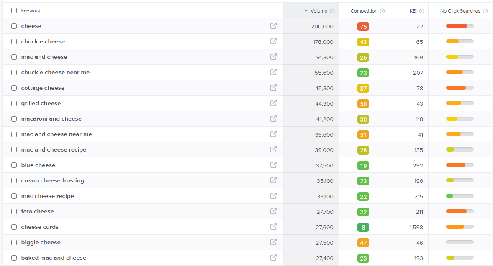

</details>

<details>
<summary>Google Search</summary>
<br>


</details>

<details>
<summary>Cheesemonger Analytics 1</summary>
<br>

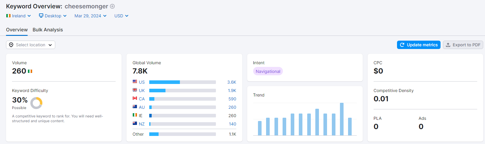

</details>

<details>
<summary>Cheesemonger Analytics 2</summary>
<br>

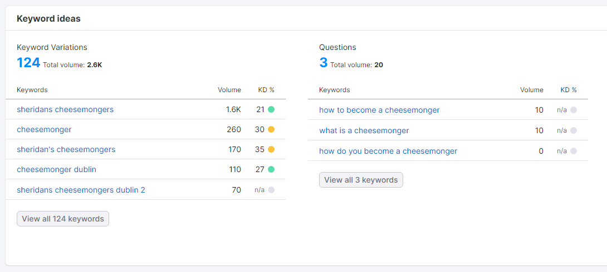

</details>

<details>
<summary>Cheesemonger Analytics 3</summary>
<br>

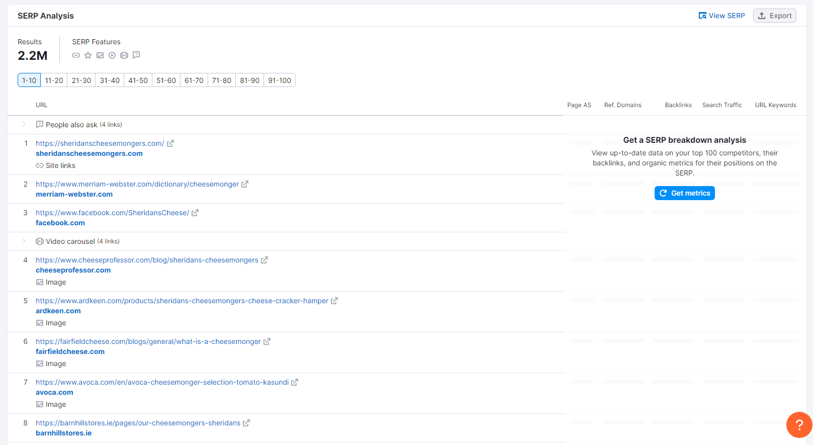

</details>

### Blog Keywords

A blog can attract users to a website with interesting information. The blog on this website will attract people with an iterest in cheese. The admins who make the posts can enter in a comma-seperated string with keywords for the blog post. The keywords serve as tags which are rendered beneath the blogpost. They are also rendered in the meta tag of base.html so these keywords are rendered in the metatag of the relevent blogposts. I created a blogtags.py to seperate the string for the tags.

<details>
<summary>Blog Keyword Field</summary>
<br>

```
keywords = models.TextField(
    help_text="Enter specific comma-separated SEO keywords",
    blank=True)
```

```

```

</details>

### Sitemap and Robots.txt

To enhance search engine optimization (SEO) and ensure search engines can effectively understand and navigate the site's structure, a sitemap file was created. This file, generated using xml-sitemaps.com, includes a list of important page URLs.

Additionally, a robots.txt file was established to guide search engines on which areas of the website they are restricted from accessing. This measure helps improve the site's SEO by focusing search engine crawlers on the most relevant and valuable content, thereby enhancing the quality of the site in search engine rankings.

### Social Media Marketing

For this site, a Facebook business page has been created for social media marketing. The Facebook page includes a 'Contact Us' button which takes the user to the Contact Page on Cheesy Store. The Facebook page link is included in the footer so appear extended from base.html to every webpage.

<details>
<summary>Cheesy Store Facebook Page</summary>
<br>

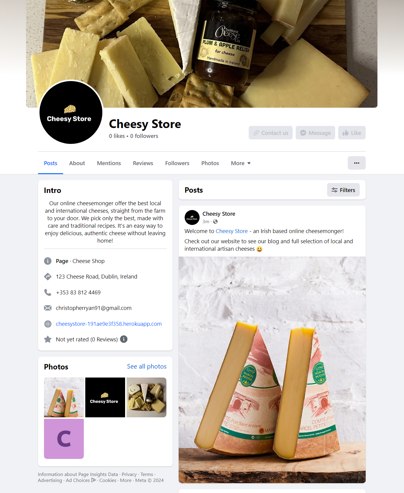

</details>

### Email Marketing

Users and visitors to the website can sign up to the newsletter. They do not need an account to do so. A signup box is present on the homepage and the contact page. This allows the business to stay in touch with customers. The newsletter can contain anything from special offers to new arrivals. Mailchimp was used for this purpose.

## Technologies Used

### Core Development Technologies & Languages

- [Django](https://www.djangoproject.com/)
- [JavaScript](https://ecma-international.org/publications-and-standards/standards/ecma-262/)
- [jQuery](https://jquery.com/)
- [CSS](https://www.w3.org/Style/CSS/Overview.en.html)
- [HTML](https://html.spec.whatwg.org/multipage/)
- [Django Templating Language](https://docs.djangoproject.com/en/4.2/ref/templates/language/)
- [Bootstrap](https://getbootstrap.com/)
- [Gunicorn](https://pypi.org/project/gunicorn/)
- [psycopg2](https://pypi.org/project/psycopg2/)
- [crispy_forms](https://django-crispy-forms.readthedocs.io/en/latest/)
- [django_summernote](https://pypi.org/project/django-summernote/)
- [PostgreSQL](https://www.postgresql.org/)
- [Heroku](https://www.heroku.com/home)
- [Amazon Web Services](https://aws.amazon.com/)
- [Wireframe CC](https://wireframe.cc/)
- [AmIResponsive](https://ui.dev/amiresponsive)
- [Heroku](https://www.heroku.com/)
- [Stripe](https://stripe.com/ie)
- [Chrome DevTools](https://developer.chrome.com/docs/devtools/)
- [Mailchimp](https://mailchimp.com/)
- [Font Awesome](https://fontawesome.com/)
- [GitHub](https://github.com/)
- [Google Fonts](https://fonts.google.com/)
- [W3](https://www.w3.org/)
- [JSHint](https://jshint.com/)
- [Table to Markdown](https://tabletomarkdown.com/convert-spreadsheet-to-markdown/)
- [Privacy Policy Generator](https://www.privacypolicygenerator.info/)
- [XML Sitemaps](https://www.xml-sitemaps.com/)

## Testing

Full testing: [TESTING.md](TESTING.md)

## Deployment - Heroku

To deploy this page to Heroku from its GitHub repository, the following steps were taken:

### Create the Heroku App:
- Log in to [Heroku](https://dashboard.heroku.com/apps) or create an account.
- On the main page click the button labelled New in the top right corner and from the drop-down menu select "Create New App".
- Enter a unique and meaningful app name.
- Next, select your region.
- Click on the Create App button.

### Attach the Postgres database:
- In the Resources tab, under add-ons, type in Postgres and select the Heroku Postgres option.
- Copy the DATABASE_URL located in Config Vars in the Settings Tab.
- Go back to your IDE and install 2 more requirements:
    - `pip3 install dj_databse_url`
    - `pip3 install psycopg2-binary` 
- Create requirements.txt file by typing `pip3 freeze --local > requirements.txt`
- Add the DATABASE_URL value and your chosen SECRET_KEY value to the env.py file. 
- In settings.py file import dj_database_url, comment out the default configurations within database settings and add the following: 

```
DATABASES = {
    'default': dj_database_url.parse(os.environ.get('DATABASE_URL'))
}
```
- Run migrations and create a superuser for the new database. 
- Create an if statement in settings.py to run the postgres database when using the app on heroku or sqlite if not

```
    if 'DATABASE_URL' in os.environ:
        DATABASES = {
            'default': dj_database_url.parse(os.environ.get('DATABASE_URL'))
        }
    else:
        DATABASES = {
            'default': {
                'ENGINE': 'django.db.backends.sqlite3',
                'NAME': BASE_DIR / 'db.sqlite3',
            }
    }
```

- Create requirements.txt file by typing `pip3 freeze --local > requirements.txt`
- Create a file named "Procfile" in the main directory and add the following: `web: gunicorn project-name.wsgi:application`
- Add Heroku to the ALLOWED_HOSTS list in settings.py in the format ['app_name.heroku.com', 'localhost']

- Push these changes to Github.

### Update Heroku Config Vars
Add the following Config Vars in Heroku:

|     Variable name     |                           Value/where to find value                           |
|:---------------------:|:-----------------------------------------------------------------------------:|
| AWS_ACCESS_KEY_ID     | AWS CSV file(instructions below)                                               |
| AWS_SECRET_ACCESS_KEY | AWS CSV file(instructions below)                                               |
| DATABASE_URL          | Postgres generated (as per step above)                                        |
| EMAIL_HOST_PASS       | Password from email client                                                    |
| EMAIL_HOST_USER       | Site's email address                                                          |
| SECRET_KEY            | Random key generated as above                                                 |
| STRIPE_PUBLIC_KEY     | Stripe Dashboard > Developers tab > API Keys > Publishable key                |
| STRIPE_SECRET_KEY     | Stripe Dashboard > Developers tab > API Keys > Secret key                     |
| STRIPE_WH_SECRET      | Stripe Dashboard > Developers tab > Webhooks > site endpoint > Signing secret |
| USE_AWS               | True (when AWS set up - instructions below)                                   |

### Deploy
- NB: Ensure in Django settings, DEBUG is False
- Go to the deploy tab on Heroku and connect to GitHub, then to the required repository. 
- Scroll to the bottom of the deploy page and either click Enable Automatic Deploys for automatic deploys or Deploy Branch to deploy manually. Manually deployed branches will need re-deploying each time the repo is updated.
- Click View to view the deployed site.

The site is now live and operational.


## AWS Set Up
### AWS S3 Bucket
- Create an AWS account.
- From the 'Services' tab on the AWS Management Console, search 'S3' and select it.
- Click 'Create a new bucket', give it a name(match your Heroku app name if possible), and choose the region closest to you.
- Under 'Object Ownership' select 'ACLs enabled' and leave the Object Ownership as Bucket owner preferred.
- Uncheck block all public access and acknowledge that the bucket will be public.
- Click 'Create bucket'.
- Open the created bucket, go to the 'Properties' tab. Scroll to the bottom and under 'Static website hosting' click 'edit' and change the Static website hosting option to 'enabled'. Copy the default values for the index and error documents and click 'save changes'.
- Open the 'Permissions' tab, locate the CORS configuration section and add the following code:
```
[
  {
      "AllowedHeaders": [
          "Authorization"
      ],
      "AllowedMethods": [
          "GET"
      ],
      "AllowedOrigins": [
          "*"
      ],
      "ExposeHeaders": []
  }
]
```
- In the 'Bucket Policy' section and select 'Policy Generator'.
- Choose 'S3 Bucket Policy' from the type dropdown.
- In 'Step 2: Add Statements', add the following settings:
    - Effect: Allow
    - Principal: *
    - Actions: GetObject
    - ARN: Bucket ARN (copy from S3 Bucket page)
- Click 'Add Statement'.
- Click 'Generate Policy'.
- Copy the policy from the popup that appears
- Paste the generated policy into the Permissions > Bucket Policy area.
- Add '/*' at the end of the 'Resource' key, and save.
- Go to the 'Access Control List' section click edit and enable List for Everyone (public access) and accept the warning box.


### IAM
- From the 'Services' menu, search IAM and select it.
- Once on the IAM page, click 'User Groups' from the side bar, then click 'Create group'. Choose a name and click 'Create'.
- Go to 'Policies', click 'Create New Policy'. Go to the 'JSON' tab and click 'Import Managed Policy'. 
- Search 'S3' and select 'AmazonS3FullAccess'. Click 'Import'.
- Get the bucket ARN from 'S3 Permissions' as per above.
- Delete the '*' from the 'Resource' key and add the following code into the area:

```
"Resource": [
    "YOUR-ARN-NO-HERE",
    "YOUR-ARN-NO-HERE/*"
]
```

- Click 'Next Tags' > 'Next Review' and then provide a name and description and click 'Create Policy'.
- Click'User Groups' and open the created group. Go to the 'Permissions' tab and click 'Add Permissions' and then 'Attach Policies'.
- Search for the policy you created and click 'Add Permissions'.
- You need to create a user to put in the group. Select users from the sidebar and click 'Add user'.
- Give your user a user name, check 'Programmatic Access'.
- Click 'Next' and select the group you created.
- Keep clicking 'Next' until you reach the 'Create user' button and click that.
- Download the CSV file which contains the AWS_SECRET_ACCESS_KEY and your AWS_ACCESS_KEY_ID needed in the Heroku variables as per above list and also in your env.py.


### Connecting S3 to Django 
- Go back to your IDE and install 2 more requirements:
    - `pip3 install boto3`
    - `pip3 install django-storages` 
- Update your requirements.txt file by typing `pip3 freeze --local > requirements.txt` and add storages to your installed apps.
- Create an if statement in settings.py 

```
if 'USE_AWS' in os.environ:
    AWS_STORAGE_BUCKET_NAME = 'insert-your-bucket-name-here'
    AWS_S3_REGION_NAME = 'insert-your-region-here'
    AWS_ACCESS_KEY_ID = os.environ.get('AWS_ACCESS_KEY_ID')
    AWS_SECRET_ACCESS_KEY = os.environ.get('AWS_SECRET_ACCESS_KEY')

```
- Then add the line 

    - `AWS_S3_CUSTOM_DOMAIN = f'{AWS_STORAGE_BUCKET_NAME}.s3.amazonaws.com'` to tell django where our static files will be coming from in production.


- Create a file called custom storages and import both our settings from django.con as well as the s3boto3 storage class from django storages. 
- Create the following classes:

```
class StaticStorage(S3Boto3Storage):
    location = settings.STATICFILES_LOCATION

class MediaStorage(S3Boto3Storage):
    location = settings.MEDIAFILES_LOCATION
```

- In settings.py add the following inside the if statement:

```
STATICFILES_STORAGE = 'custom_storages.StaticStorage'
STATICFILES_LOCATION = 'static'
DEFAULT_FILE_STORAGE = 'custom_storages.MediaStorage'
MEDIAFILES_LOCATION = 'media'
STATIC_URL = f'https://{AWS_S3_CUSTOM_DOMAIN}/{STATICFILES_LOCATION}/'
MEDIA_URL = f'https://{AWS_S3_CUSTOM_DOMAIN}/{MEDIAFILES_LOCATION}/'

```

- and then add the following at the top of the if statement:
```
AWS_S3_OBJECT_PARAMETERS = {
    'Expires': 'Thu, 31 Dec 2099 20:00:00 GMT',
    'CacheControl': 'max-age=94608000',
}
```

- Go to S3, go to your bucket and click 'Create folder'. Name the folder 'media' and click 'Save'.
- Inside the folder, click 'Upload', 'Add files', and then select all the images that you are using for your site.
- Then under 'Permissions' select the option 'Grant public-read access' and click upload.
- Your static files and media files should be automatically linked from django to your S3 bucket.

## Forking this repository
- Locate the repository at this link [Cheesy Store](https://github.com/chrisryan91/CheesyStore_PP5).
- At the top of the repository, on the right side of the page, select "Fork" from the buttons available. 
- A copy of the repository is now created.

## Cloning this repository
To clone this repository follow the below steps: 

1. Locate the repository at this link [Cheesy Store](https://github.com/chrisryan91/CheesyStore_PP5). 
2. Under **'Code'**, see the different cloning options, HTTPS, SSH, and GitHub CLI. Click the prefered cloning option, and then copy the link provided. 
3. Open **Terminal**.
4. In Terminal, change the current working directory to the desired location of the cloned directory.
5. Type **'git clone'**, and then paste the URL copied from GitHub earlier. 
6. Type **'Enter'** to create the local clone. 

## Credits

Blankety Black Checkbook and Pen