# Full Testing

## Contents
- [Full Testing](#full-testing)
  - [Contents](#contents)
  - [Testing User Stories](#testing-user-stories)
  - [User Story 1](#user-story-1)
  - [Validator Testing](#validator-testing)
    - [HTML](#html)
    - [CSS](#css)
    - [JavaScript](#javascript)
    - [Python](#python)
    - [Django Extensions](#django-extensions)
  - [Lighthouse Testing](#lighthouse-testing)
  - [Automated Testing](#automated-testing)
  - [Manual Testing](#manual-testing)
  - [Responsiveness Testing](#responsiveness-testing)
    - [Browsers](#browsers)
    - [Devices](#devices)
  - [Bugs](#bugs)
    - [Fixed Bugs](#fixed-bugs)
    - [Known Bugs](#known-bugs)

## Testing User Stories

User Stories were created at the start of my project.

Link to Projects Board: [Project Board](https://github.com/users/chrisryan91/projects/5/views/1)

## User Story 1: As a site administrator, I can manage user accounts, including activating, deactivating, and deleting accounts, so that I can maintain the site's user base and security.

At the start of the project, the Code Institute template was utilized. After setting up the Development Environment and installing Django, a superuser was created. Proper configuration provided access to the admin panel, enabling the management of user accounts for site userbase and security maintenance.

Here is an example of a class that Registers my blog posts with the admin panel:

<details>
<summary>User Story 1</summary>
<br>

```
class ProductAdmin(admin.ModelAdmin):
    # Specify the fields to display in the admin list view.
    list_display = (
        'sku',
        'name',
        'category',
        'origin',
        'cheesetype',
        'rating',
        'image',
        'in_stock'
    )


# CategoryAdmin Configuration.
class CategoryAdmin(admin.ModelAdmin):
    # Display fields for categories.
    list_display = (
        'friendly_name',
        'name'
    )


# CheeseType Configuration.
class CheeseTypeAdmin(admin.ModelAdmin):
    # Configuration for CheeseType model to improve admin interface.
    list_display = (
        'friendly_name',
        'name'
    )


# Cheese Origin Configuration.
class OriginAdmin(admin.ModelAdmin):
    # Display fields for the admin model.
    list_display = (
        'friendly_name',
        'name'
    )


class RatingAdmin(admin.ModelAdmin):
    list_display = ('product', 'user', 'stars')
    list_filter = ('product', 'user')
    search_fields = ('product__name', 'user__username')

```
</details>

## 2: As a site user, I can subscribe to the newsletter to receive updates on new cheese arrivals, promotions, and blog posts so that I can stay informed. 

To complete this User Story, an account with MailChimp was established, which supplied an embeddable form, CSS styling, and JavaScript for integration into the website. The MailChimp dashboard is used to manage the audience list of individuals who subscribed to the newsletter.

<details>
<summary>User Story 2</summary>
<br>

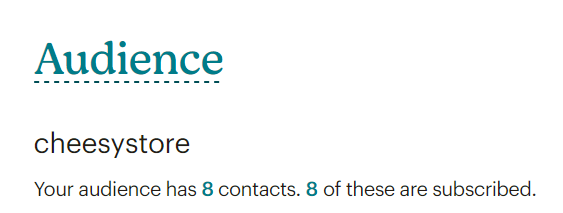

</details>

## User Story 3: As a site user, I can read blog posts about cheese tasting, pairing tips, and cheese-making processes so that I can expand my knowledge and appreciation of cheese.

To fulfill this user story, a new app was initiated with the command "python manage.py startapp cheesyblog". This step enabled the creation of models, views, URLs, and templates necessary for the app's functionality. Consequently, it became possible for an admin to publish blog posts through the Django admin panel and display them on the site using a template. A dedicated page, "cheesyblogpost", was also developed for users to read the complete posts. The intention behind the blog is to draw visitors interested in cheese to the website and convert them into potential customers.

Below is the view which gets the blog post from the database and renders it to the template.

<details>
<summary>User Story 3</summary>
<br>

```
class CheesyBlogListView(ListView):
    # Specify the model to retrieve data form.
    model = Post
    # Template path.
    template_name = 'cheesyblog/cheesyblog.html'
    # Name of the variable in the template.
    context_object_name = 'posts'
    # Number of posts per page.
    paginate_by = 6
    posts = Post.objects.filter(status=1).order_by('-created_on')

    # Define the query to fetch published posts and order them.
    def get_queryset(self):
        return Post.objects.filter(status=1).order_by('-created_on')

    # Context data with total posts count and pages count.
    def get_context_data(self, **kwargs):
        context = super().get_context_data(**kwargs)
        total_posts = Post.objects.filter(status=1).count()
        context['total_posts'] = total_posts

        paginator = Paginator(self.get_queryset(), self.paginate_by)
        total_pages = paginator.num_pages
        context['total_pages'] = total_pages

        return context
```

</details>

## User Story 4: As a site user, I can leave comments and reviews on cheeses and blog posts so that I can share my opinions and experiences with other users.

To achieve this User Story, a model for comments was established, including fields for the associated post, the commenting user, the comment text, creation time, and approval status. Subsequently, a form was defined in forms.py, utilizing a meta class to link the form with the comment model. This form exclusively offers a field for the comment body, as the remaining fields are populated automatically. The final step involved updating the view to enable commenting features, ensuring the form is displayed in the template only to authenticated users.

<details>
<summary>User Story 4</summary>
<br>
```
class Comment(models.Model):
    post = models.ForeignKey(
        Post,
        on_delete=models.CASCADE,
        related_name="comments"
    )
    user = models.ForeignKey(
        User,
        on_delete=models.CASCADE,
        related_name='comments_user'
    )
    body = models.TextField(max_length=1000)
    created_on = models.DateTimeField(default=timezone.now)
    approved = models.BooleanField(default=False)
```

```
class CommentForm(forms.ModelForm):
    # Meta class to specify which model the form is associated with.
    class Meta:
        model = Comment
        fields = ('body',)
```

```
  
  <h4>Leave a comment:</h4>
  <p class="text-muted">{{ user.username }}</p>
  <form method="post" id="commentform">
      {{ comment_form|crispy }}
      
      <button type="submit" class="btn" id="commentsubmit"><u>Submit</u></button>
  </form>
  

```
</details>


## User Story 5: As a site administrator, I can create and publish blog posts about cheese-related topics so that I can engage users and attract traffic to the site.

Following the setup of blog models, views, URLs, and their integration with templates, the next step was to register the Post and Comment models in Django's admin panel. This registration allowed for the addition and approval of posts and user comments directly from the admin interface. The necessary admin classes for these actions were then established.

<details>
<summary>User Story 5</summary>
<br>

```
@admin.register(Post)
class PostAdmin(SummernoteModelAdmin):
    # Configure the list display in the admin panel to show these fields
    list_display = ('title', 'slug', 'status', 'created_on')
    # Enable searching within the title and content fields
    search_fields = ['title', 'content']
    # Fill the slug field based on the title to avoid manual entry
    prepopulated_fields = {'slug': ('title',)}
    # Filter options.
    list_filter = ('status', 'created_on')
    # Specify which fields should use the Summernote rich-text editor
    summernote_fields = ('content',)

    fieldsets = (
        (None, {
            'fields': ('title', 'slug', 'author', 'status')
        }),
        ('Content', {
            'fields': ('content', 'keywords'),
            'classes': ('collapse',),
        }),
    )

@admin.register(Comment)
class CommentAdmin(admin.ModelAdmin):
    # Configure the list display to show these specific fields for each comment
    list_display = ('user', 'body', 'post', 'created_on', 'approved')
    # Adjust or remove these fields based on your actual model definitions.
    search_fields = ['user', 'post']
    # Filter options.
    list_filter = ('approved', 'created_on')
    # Custom admin action to approve comments directly from the list view
    actions = ['approve_comments']

    # Define a custom action.
    def approve_comments(self, request, queryset):
        # Marks approved selected comments.
        queryset.update(approved=True)
    # Provide a short description for the action
    approve_comments.short_description = "Mark selected comments as approved"
```
</details>

## User Story 6: As a site administrator, I can add, edit, and delete cheeses from the store inventory so that I can manage the product catalog.

For this user story, separate HTML pages were developed for the editing and deletion of products from the database. "Delete" and "Edit" buttons were introduced, visible only to superusers, placed beneath the product listings on both the main store page and the individual product detail pages. These buttons are linked to URLs that activate specific views for adding, editing, and deleting products. When the delete button is clicked, a confirmation query "Are you sure?" is presented to the user, and selecting the edit button redirects the user to an 'edit_product' HTML page for modifications.

Additionally, within the navigation bar's "My Account" section, a dedicated link to an 'add_product' page is made available exclusively for superusers. This link leads to a blank form, allowing for the entry of new products into the database.

<details>
<summary>User Story 6</summary>
<br>

```
def add_product(request):

    if not request.user.is_superuser:
        
        # Return error message is user is not a superuser.
        messages.error(request, 'Sorry only store owners can do that')
        return redirect(reverse('home'))

    if request.method == 'POST':
        form = ProductForms(request.POST, request.FILES)
        if form.is_valid():
            # Save the form if it is valid and provide success message.
            product = form.save()
            messages.info(request, 'Successfully added product!')
            return redirect(reverse('product_detail', args=[product.id]))
        else:
            # Return error message otherwise.
            messages.error(request, 'Failed to add product!!')
    else:
        form = ProductForms()

    # Prepare template and context.
    template = 'products/add_product.html'
    context = {
        'form': form,
        'ignore_section': True,
    }

    # Return template with context.
    return render(request, template, context)


@login_required
def edit_product(request, product_id):

    # Check if the user is a superuser and return error if not.
    if not request.user.is_superuser:
        messages.error(request, 'Sorry only store owners can do that')
        return redirect(reverse('home'))

    # Show 404 error is product is not found.
    product = get_object_or_404(Product, pk=product_id)

    # Process the form data if request is POST.
    if request.method == 'POST':
        form = ProductForms(request.POST, request.FILES, instance=product)
        # Check if the form is valid and save if so.
        if form.is_valid():
            form.save()
            messages.info(request, 'Successfully updated product')
            return redirect(reverse('product_detail', args=[product.id]))
        else:
            messages.error(request, 'Failed to update product')
    else:
        # If not a POST request initialise form with product instance.
        form = ProductForms(instance=product)
        messages.info(request, f'You are editing {product.name}')

    # Define template and context
    template = 'products/edit_product.html'
    context = {
        'form': form,
        'product': product,
        'ignore_section': True,
    }

    # Render and return the template with context.
    return render(request, template, context)


@login_required
def delete_product(request, product_id):
    # Check if the user is a superuser.
    if not request.user.is_superuser:
        messages.error(request, 'Sorry only store owners can do that')
        # Redirect to homepage if not a superuser.
        return redirect(reverse('home'))

    # Return 404 error if product not found.
    product = get_object_or_404(Product, pk=product_id)

    # Delete the product if found, provide success message and redirect to list of products.
    product.delete()
    messages.info(request, 'Product Deleted!')
    return redirect(reverse('products'))
```
</details>

## User Story 7: As a site user, I can create an account and log in so that I can track my order history and manage my profile information.

Authentication within the project is managed using Django AllAuth. The AllAuth User model was installed and imported to manage user information efficiently. Users have the capability to register using an email and a password. Upon registration, a profile page is automatically created for each user, accessible via a link in the navigation bar. This profile page displays the user's shipping information and order history.

A User Profile Form was crafted in forms.py and incorporated into the view that renders the Profile page. This form on the profile page comes pre-filled with the user's existing information, which can be updated as needed.

For each order listed, a link is provided that redirects to the Checkout Success page relevant to that particular purchase, allowing users to review the details of their past transactions. The details for this functionality are shown in the specified view below:

<details>
<summary>User Story 7</summary>
<br>

```
class UserProfileForm(forms.ModelForm):
    class Meta:
        model = UserProfile
        exclude = ('user',)

    def __init__(self, *args, **kwargs):
        super().__init__(*args, **kwargs)

        # Define placeholders for the form fields.
        placeholders = {
            'default_phone_number': 'Phone Number',
            'default_postcode': 'Postal Code',
            'default_town_or_city': 'Town or City',
            'default_street_address1': 'Street Address 1',
            'default_street_address2': 'Street Address 2',
            'default_county': 'County, State or Locality',
        }

        self.fields['default_phone_number'].widget.attrs['autofocus'] = True

        # Loop through the form fields to set their placeholders.
        for field in self.fields:
            # Skip default_country field.
            if field != 'default_country':
                if self.fields[field].required:
                    # Add a star to signify required.
                    placeholder = f'{placeholders[field]} *'
                else:
                    placeholder = placeholders[field]
                # Set the place holder attribute.
                self.fields[field].widget.attrs['placeholder'] = placeholder

            # Set CSS
            self.fields[field].widget.attrs['class'] = 'border-black rounded-0 profile-form-input'

            # Remove fields label.
            self.fields[field].label = False
```

```
def order_history(request, order_number):

    # Retrieve the Order instance with the given order_number or return 404.
    order = get_object_or_404(Order, order_number=order_number)

    # Display an informational message about the order history.
    messages.info(request, (
        f'This is a past confirmation for order number {order_number}'
        'A confirmation email was sent on the order date.'
    ))

    # Define the template and context for profile page.
    template = 'checkout/checkout_success.html'
    context = {
        'order': order,
    }

    # Render and return the order history for the profile.
    return render(request, template, context)
```

</details>

## User Story 8: As a site user, I can view detailed information about each cheese, including its origin, flavor profile, and suggested pairings, so that I can make an informed decision.

This User Story is incomplete because the functionality for displaying each cheese's flavor profile and suggested pairings has not yet been implemented. Currently, the model for each cheese includes attributes for category, origin, type, a brief description, and an image.

To present this information, a link directs from the main store to a Product Detail page, which displays all the available data about the cheese from the database. Below are the Product model details and an image of what the Product Detail page looks like upon completion.

<details>
<summary>User Story 8</summary>
<br>

```
class Product(models.Model):
    # Category of the product.
    category = models.ForeignKey('Category', null=True, blank=True, on_delete=models.SET_NULL)
    # Type of cheese.
    cheesetype = models.ForeignKey('CheeseType', null=True, blank=True, on_delete=models.SET_NULL)
    # Origin of cheese.
    origin = models.ForeignKey('Origin', null=True, blank=True, on_delete=models.SET_NULL)
    sku = models.CharField(max_length=254, null=True, blank=True)
    name = models.CharField(max_length=254)
    description = models.TextField()
    price = models.DecimalField(max_digits=6, decimal_places=2)
    rating = models.DecimalField(max_digits=6, decimal_places=2, null=True, blank=True)
    in_stock = models.BooleanField(default=True, null=True, blank=True)
    image_url = models.URLField(max_length=1024, null=True, blank=True)
    image = models.ImageField(null=True, blank=True)

    def __str__(self):
        # String representation.
        return self.name
```

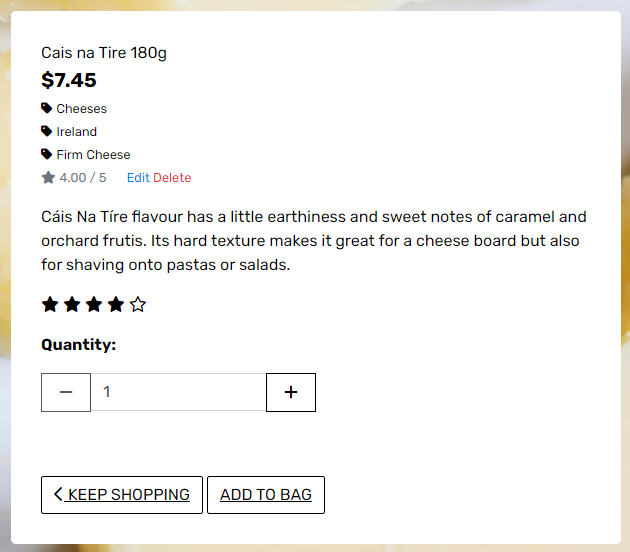
</details>


## User Story 9: As a site user, I can search for specific types of cheeses (e.g., soft, hard, aged) so that I can find cheeses that match my preferences.

To fulfill this User Story, a search bar was integrated as a dropdown item in the Navigation bar. This search icon is visible across all pages and adapts to all screen sizes, providing users with the ability to search the store's products. The dropdown search bar, designed as a form element, sends queries to the 'products' URL, activating the all_products view. The search functionality attempts to match the query with product names or descriptions. The resulting view displays products that match the search criteria or, alternatively, a message indicating the absence of matching items.

<details>
<summary>User Story 8</summary>
<br>


```
<a class="text-black nav-link" href="#" id="mobile-search" data-toggle="dropdown" aria-haspopup="true" aria-expanded="false">
    <div class="text-center">
        <div><i class="fas fa-search"></i></div>
        <p class="my-0">Search</p>
    </div>
</a>
<div class="dropdown-menu border-0 w-50 p-3 rounded-0 my-0" aria-labelledby="mobile-search">
    <form class="form" method="GET" action="">
        <div class="input-group w-100">
            <input class="form-control border border-black rounded-0" type="text" name="q" placeholder="Search for products">
            <div class="input-group-append">
                <button class="form-control form-control btn border border-black rounded-0" type="submit">
                    <span class="icon">
                        <i class="fas fa-search"></i>
                    </span>
                </button>
            </div>
        </div>
    </form>
</div>


if 'q' in request.GET:
    query = request.GET['q']
    if not query:
        messages.error(request, "You didn't enter any search criteria!")
        return redirect(reverse('products'))
    
    queries = Q(name__icontains=query) | Q(description__icontains=query)
    products = products.filter(queries)

```

</details>

## User Story 10: As a site user, I can add cheeses to my cart and proceed to checkout so that I can purchase them.

To achieve this User Story, a new app named Bag was initiated using the command python manage.py startapp bag. An "Add to Bag" button was introduced on the product detail page, designed to store the selected product and its specified quantity in session storage. Within the Bag app's views, the add_to_bag function is responsible for extracting product information stored in session storage. This information is then displayed on the Bag HTML page, allowing users to view the details of their intended purchase.

<details>
<summary>User Story 10</summary>
<br>

```
def add_to_bag(request, item_id):

    product = get_object_or_404(Product, pk=item_id)

    quantity = int(request.POST.get('quantity'))
    redirect_url = request.POST.get('redirect_url')

    # Retrieve the bag from the session - or initialise it.
    bag = request.session.get('bag', {})

    # If the item exists, update it's quantity.
    if item_id in list(bag.keys()):
        bag[item_id] += quantity
        messages.success(
            request,
            f'Update {product.name} quantity to {bag[item_id]}')
    else:
        # If the item is not in the bag, add it.
        bag[item_id] = quantity
        messages.success(request, f'Added {product.name} to your bag')

    # Save Updated Bag
    request.session['bag'] = bag
    return redirect(redirect_url)
```
</details>

## User Story 11: As a site user, I can browse a variety of cheeses so that I can explore different options.

For this User Story, the requirement was to display all products from the database on the store HTML page accessible by users. This was achieved using the all_products view to fetch the products. The rendering of these products on the page is accomplished through a for loop, where each product is presented within a dedicated card div. This div includes the product's name, image, price, rating, type, availability (e.g., in stock or not), among other attributes. To manage the display of a large number of products, the page implements pagination, dividing the content across multiple pages for easier navigation.

<details>
<summary>User Story 1</summary>
<br>

```

<div class="col-xs-1 col-sm-6 col-md-4 col-lg-3 col-xl-2">
    <div class="card h-100 border-0">
        
        <a href="">
            
        </a>
        
        <a href="">
            
        </a>
        
        <div class="card-body pb-0">
            <p class="mb-0">{{ product.name }}</p>
        </div>
        <div class="card-footer bg-white pt-0 border-0 text-left">
            <div class="row">
                <div class="col">
                    
                    <p class="lead mb-0 text-left font-weight-bold">${{ product.price }}</p>
                    
                    <p class="lead mb-0 text-left font-weight-bold soldout">Sold Out</p>
                    
                    
                    <p class="small mt-1 mb-0">
                        <a href="?origin={{ product.origin.name }}" class="text-dark nextlast">
                            <i class="fas fa-tag mr-1"></i>{{ product.origin.friendly_name }}
                        </a>
                    </p>
                    
                    
                    <p class="small mt-1 mb-0">
                        <a href="?cheesetype={{ product.cheesetype.name }}" class="text-dark nextlast">
                            <i class="fas fa-tag mr-1"></i>{{ product.cheesetype.friendly_name }}
                        </a>
                    </p>
                    
                    
                    <p class="small mt-1 mb-0"> 
                        <small class="text-dark"><i class="fas fa-star mr-1"></i>{{ product.rating }} / 5</small>
                    </p>
                    
                    <p class="small mt-1 mb-0">
                        <small class="text-dark">No Rating</small>
                    </p>
                    
                    
                        <p class="small mt-1 mb-0">
                            <a href="">Edit</a>
                            <a href="" class="text-danger deleteproduct">Delete</a>
                        </p>
                    
                </div>
            </div>
        </div>
    </div>
</div>
```

</details>

## user Story 12: As a user, I want to be able to set up an account and login in and log out so I can purchase items and leave a comment.

The account tab in the navigation bar provides users with options to sign in, sign out, and register, each leading to separate HTML pages equipped with forms for login and logout functionality. Although creating an account is not a prerequisite for making a purchase, registering enables users to create a savable profile and grants them the privilege to comment on blog posts. The authentication process is managed through Django AllAuth.

<details>
<summary>User Story 12 - Register Screenshot</summary>
<br>


</details>


<details>
<summary>User Story 12 - Login Screenshot</summary>
<br>

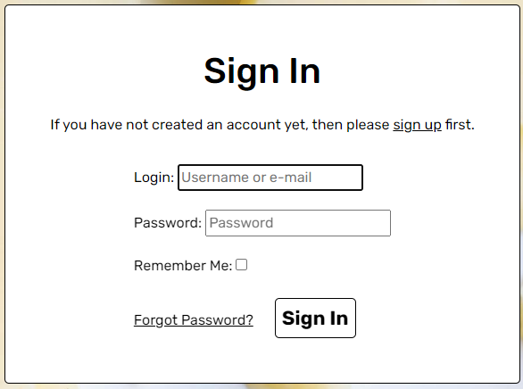
</details>


## 13: As a user, I want to easily find answers to frequently asked questions so that I can make informed decisions about the products and policies without needing to wait for a response from customer service.

For this User Story, the objective was to develop a Frequently Asked Questions (FAQ) page. Initial research involved reviewing FAQ sections of other online stores to identify common questions relevant to this business type, such as inquiries about privacy, card data security, return policies, account details, and other pertinent internal links.

A new app was created to facilitate this feature, anticipating future functionalies. No new models were required for this implementation — only a simple view to serve a webpage and a template. This template extends base.html and presents a series of questions and answers addressing the identified common concerns.

<details>
<summary>User Story 13 - FAQ Screenshot</summary>
<br>

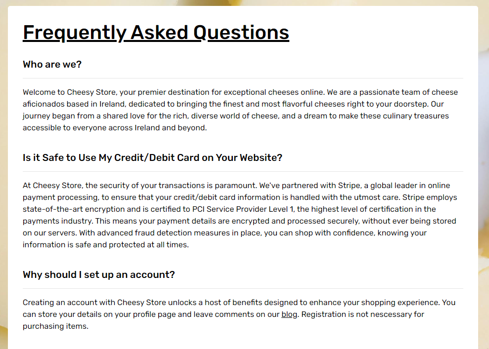
</details>

## User Story 14: As a potential customer, I want to interact with a chatbot on the cheese-selling website so that I can receive personalized recommendations, get answers to my questions about the products, and have assistance throughout the checkout process, making my shopping experience smoother and more enjoyable.

This User Story remains incomplete. During the research of other online stores, I saw that many featured chatbots, highlighting their usefulness. The potential for integrating the ChatGPT API into a web application caught my interest. However, due to the constraints of a submission deadline, there was insufficient time to implement this feature. Post-submission, the development of the chatbot integration will be a priority enhancement for the project.

The API key is still stored in my env.py file so it is not pushed to GitHub.

## User Story 15: As a user, I want to subscribe to a monthly cheese subscription service so that I can discover new cheeses and have a consistent supply of high-quality cheese without having to reorder manually each time.

This User Story has not been completed. At present, Cheesy Store supports only single payments. The addition of this User Story was motivated by the desire to implement a subscription payment model using Stripe. The concept of a cheesemonger service is well-suited to a subscription model, where customers could pay for a selection of new cheeses on a monthly basis.

A basic example of a Stripe payment function for creating new subscriptions was foundon Stackover which will serve as a foundation for further development.

<details>
<summary></summary>
<br>

```
def create_subscription(user: User, plan_id: str):
    try:
        # Create a new Stripe customer if the user doesn't already have one
        if not user.profile.stripe_customer_id:
            customer = stripe.Customer.create(
                email=user.email,
                name=user.get_full_name(),
            )
            user.profile.stripe_customer_id = customer.id
            user.profile.save()

        # Create the subscription
        subscription = stripe.Subscription.create(
            customer=user.profile.stripe_customer_id,
            items=[{'plan': plan_id}],
        )

        return subscription
    except stripe.error.StripeError as e:
        # Handle any Stripe errors
        print(f"Stripe error: {e}")
        return None

```

</details>

## 16: As a user, I want to participate in a loyalty program that rewards me for my purchases so that I can enjoy discounts, get early access to new products, and access exclusive content.

This User story is unfinished. A loyalty prohgram seemed a great way to encourage repeat business which could build a stronger relationship with my customers. For this, I would expand my User Profile app. I would create a LoyaltyPoint class based view and determine the points the users has accumulated. I would need to access their Order History and the amount they have spent. I would need to determine the mechanism for spending points - and how many points are needed for discounts, access to new products etc.

<details>
<summary></summary>
<br>

```
class LoyaltyPoint(models.Model):
    user = models.ForeignKey(User, on_delete=models.CASCADE)
    points = models.IntegerField(default=0)
    earned_on = models.DateTimeField(auto_now_add=True)

    def __str__(self):
        return f"{self.user.username} - {self.points} points"

```

</details>

## Validator Testing

### HTML

Each seperate page was tested twice: once if a user is logged in, and again if a user is logged out. One error was found and remains unfixed. On the Edit Product page, the img element for a product to be edited does not have an alt attribute. The img element in this page is a preview of an image so it remains unfixed.

| Page             | Logged In                                             | Logged Out |
| ---------------- | ----------------------------------------------------- | ---------- |
| Home Page        | No Errors                                             | No Errors  |
| Products         | No Errors                                             | No Errors  |
| Product Details  | No Errors                                             | No Errors  |
| Blog             | No Errors                                             | No Errors  |
| Blog Detail      | No Errors                                             | No Errors  |
| FAQ              | No Errors                                             | No Errors  |
| Contact Us       | No Errors                                             | No Errors  |
| Profile          | No Errors                                             | N/A        |
| Add Product      | No Errors                                             | N/A        |
| Edit Product     | Error - Alt Altribute Not Present For "Current Image" | N/A        |
| Edit Comment     | No Errors                                             | N/A        |
| Bag              | No Errors                                             | No Errors  |
| Checkout         | No Errors                                             | No Errors  |
| Checkout Success | No Errors                                             | No Errors  |
| 404 Error        | No Errors                                             | No Errors  |

### CSS

The four css files were tested with no errors with the W3 CSS Validator.

<details>
<summary>Base CSS Validation</summary>
<br>

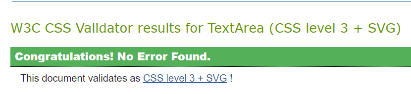
</details>

<details>
<summary>Blog CSS Validation</summary>
<br>

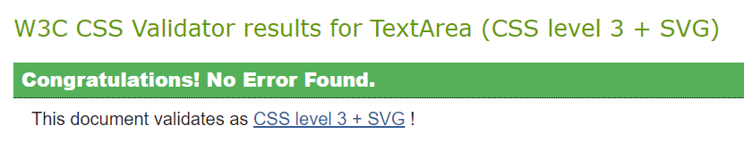
</details>

<details>
<summary>Profile CSS Validation</summary>
<br>

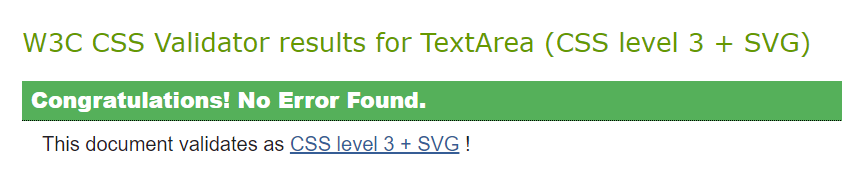
</details>

<details>
<summary>Checkout CSS Validation</summary>
<br>

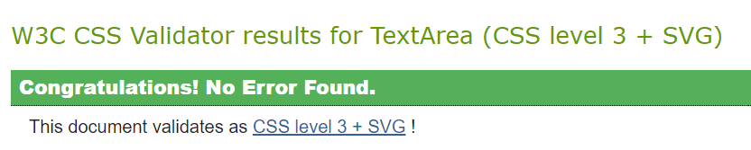
</details>

### JavaScript

Aside from one error from Stripe, my dedicated JavaScript and jQuery files ran no errors.

<details>
<summary>Add Product Script</summary>
<br>

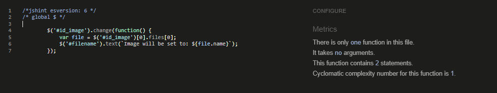
</details>

<details>
<summary>Bag Script 1</summary>
<br>

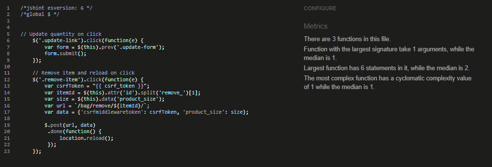
</details>

<details>
<summary>Bag Script 2</summary>
<br>

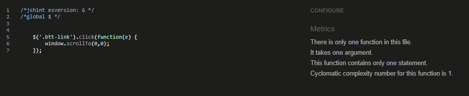
</details>

<details>
<summary>Blog Post Script 1</summary>
<br>

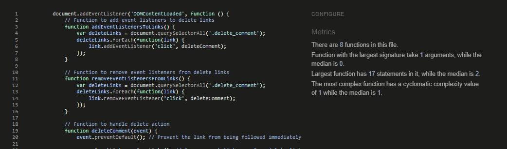
</details>

<details>
<summary>Blog Post Script 2</summary>
<br>

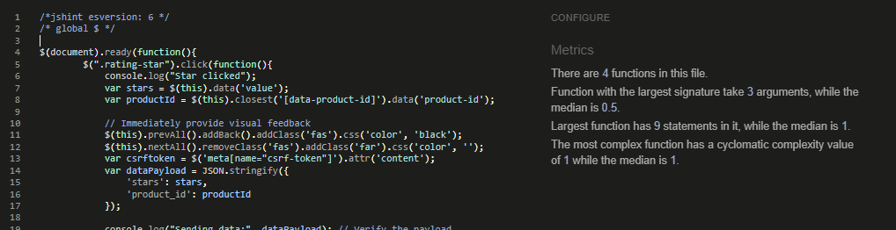
</details>

<details>
<summary>Delete Comment Script</summary>
<br>

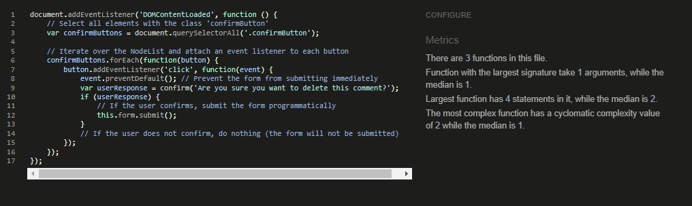
</details>

<details>
<summary>Product Detail Script</summary>
<br>

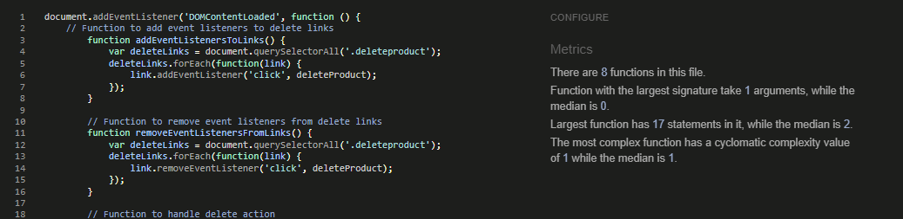
</details>

<details>
<summary>Product Script</summary>
<br>

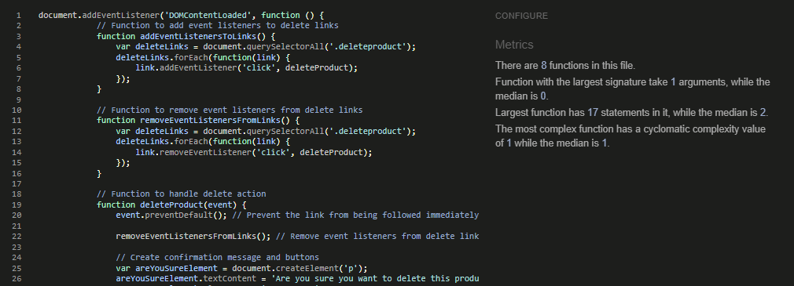
</details>

<details>
<summary>Sort Selector Script</summary>
<br>

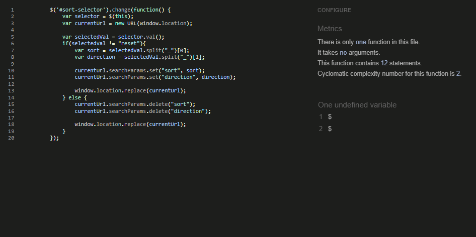
</details>

<details>
<summary>Stripe Script</summary>
<br>

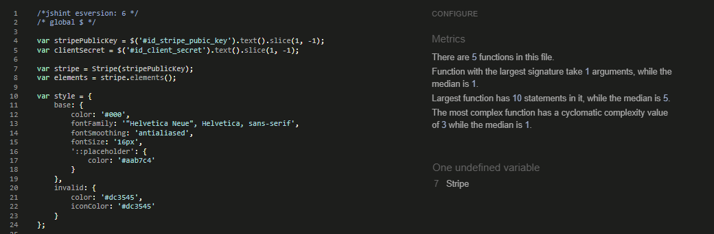
</details>

### Python

Using the Code Institute PEP8 Python linter and Flake8 in my IDE, I confirmed that all my Python files adhere to PEP8 standards, with no issues reported by the online PEP8 linter. Flake8 identified some concerns, primarily within Django-generated migration files; I chose not to modify these auto-generated files. The env.py file, not uploaded to GitHub, also raised issues. Additionally, Flake8 flagged several unused imports, which I've retained for anticipated future use.

<details>
<summary>Flake8</summary>
<br>

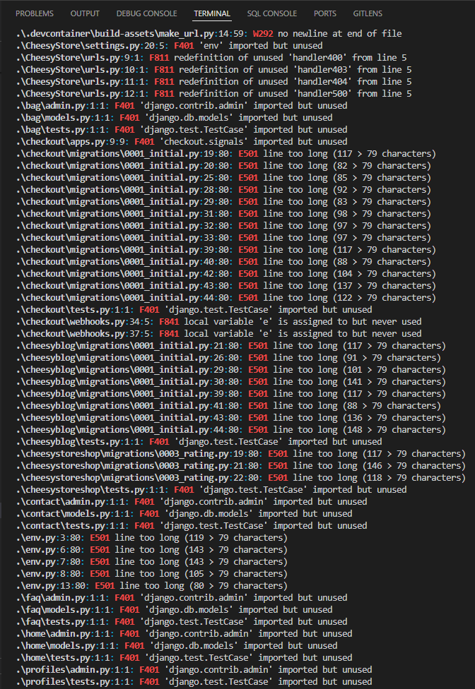
</details>

### Django Extensions

I installed [Django Extensions](https://github.com/django-extensions/django-extensions) to see if there were errors with the code in my templates. None were found.

<details>
<summary>Django Template Validation</summary>
<br>


</details>

## Lighthouse Testing

Beneath is Lighthouse testing from Chrome Dev tools for each of the main pages on my app. The performance of the app is affected by the images returned from the API on the search page and images from Cloudinary.

<details>
<summary>Homepage Lighthouse</summary>
<br>


</details>

## Automated Testing

<details>
<summary>Coverage Report</summary>
<br>


</details>

## Manual Testing

|Main Nav| | | |
|:---:|:---:|:---:|:---:|
|Element|Action|Expected Result|Works|
|CheesyStore Icon|Click|Return Home|Yes|
|Products Link|Click|Menu Dropdown|Yes|
|Categories Link|Click|Menu Dropdown|Yes|
|More Link|Click|Menu Dropdown|Yes|
|Search Link|Click|Search Bar Drops|Yes|
|My Account Link|Click|Menu Dropdown|Yes|
|Bag Link|Click|Links to bag|Yes|
| | | | |
|Footer| | | |
|Privacy Policy Link|Click|Links Externally to Privacy Policy|Yes|
|Social Media Links|Click|Links Externally to Social Media Platform|Yes|
|Privacy Policy Link|Click|Links Internally to Contact Page|Yes|
| | | | |
|Products Dropdown| | | |
|All Products Link|Click|Links to all products|Yes|
|Cheeses Link|Click|Links to cheeses|Yes|
|Butters Link|Click|Links to butters|Yes|
|Crackers Link|Click|Links to crackers|Yes|
| | | | |
|Categories Dropdown| | | |
|Types Links|Click|Links to specific type|Yes|
|Origins Links|Click|Links to crackers|Yes|
| | | | |
|More Dropdown| | | |
|FAQ Link|Click|Links to FAQ page|Yes|
|Contact Link|Click|Links to contact page|Yes|
|Blog Link|Click|Links to blog|Yes|
| | | | |
|My Account Dropdown| | | |
|Product Management Link|Click|Links to Product Managment page|Yes|
|My Profile Link|Click|Links to My Profile page|Yes|
|Logout Link|Click|Links to Sign Out page|Yes|
|Register Link|Click|Links to Register Page|Yes|
|Login Link|Click|Links to Login Page|Yes|
| | | | |
|Sign Out | | | |
|Sign Out link|Click|Sign Out and return Home|Yes|
| | | | |
|Register Page/Sign Up Page| | | |
|Sign Up Link|Click (if data is invalid)|Returns form|Yes|
|Sign Up Link|CLick (if data is valid)|Sends Email|Yes|
|Sign Up Link|CLick (if data is valid)|Returns where??|No|
| | | | |
|Sign In Page| | | |
|Sign In Link|Click (if data is invalid)|Returns form with invalid information|Yes|
|Sign In Link|Click (if data is valid)|Logins in|Yes|
|Sign In Link|Click (if data is valid)|Returns homepage|Yes|
|Forgot Password Link|Click|Returns retrieve password page|Yes|
| | | | |
|Products Page| | | |
|Sort Dropdown|Click|Dropdown Appears|Yes|
|Sort Dropdown Options|Click|Sorts Product Correctly|Yes|
|Product Image|Click|Links to Product Page|Yes|
|Edit Product Link|Click|Links to Edit Product Page|Yes|
|Delete Product Link|Click|Links to Delete Product Page|Yes|
|Next Page Link|Click|Links to next paginated page|Yes|
|Last Page Link|Click|Links to final paginated page|Yes|
| | | | |
|Product Page| | | |
|Decrease Button (when quantity is one)|Click|Nothing|Yes|
|Decrease Button (when quantity is two or above)|Click|Value Decreases|Yes|
|Increase Button (when quantity is one or above)|Click|Value Increases|Yes|
|Keep Shopping Link|Click|Returns to Products Page|Yes|
|Add to Bag Link|Click|Adds Product to Bag|Yes|
|Add to Bag Link|Click|Success Toast Appears|Yes|
|Edit Product Link|Click|Links to Edit Product Page|Yes|
|Delete Product Link|Click|Deletes Product|Yes|
|Cheeses, Origins, CheeseTypes Tag Links|Click|Returns to Search Page with Correct Tag|Yes|
|Voting Stars|Click|Star Color Changes|Yes|
|Voting Stars|Click|Rating Correctly Changes |Yes|
| | | | |
|Product Management - Add Product| | | |
|Category, CheeseType, Origin, In Stock Dropdown|Click|Dropdown Menu Appears with Correct Values|Yes|
|Select Image Button|Click|Box Appears to with File Explorer|Yes|
|Add Product Button (with invalid data)|Click|Form is returned with Invalid Data tag|Yes|
|Add Product Button (with valid data)|Click|New Product Page Returned|Yes|
| | | | |
|Product Management - Edit Product| | | |
|Category, CheeseType, Origin, In Stock Dropdown|Click|Dropdown Menu Appears with Correct Values|Yes|
|Select Image Button|Click|Box Appears to with File Explorer|Yes|
|Remove Option|Ticked|Image Removed|Yes|
|Edit Product Button (with invalid data)|Click|Form is returned with Invalid Data tag|Yes|
|Edit Product Button (with valid data)|Click|Product Page Returned Updated|Yes|
|Cancel Button|Clicked|Products Page Returned|Yes|
|Delete Product Link|Click|Deletes Product|Yes|
| | | | |
|Bag| | | |
|Minus Button (if value is 1)|Click|Nothing|No|
|Minus Button (if value is 1 or more)|Click|Increases Value|Yes|
|Plus Button|Click|Increases Value |Yes|
|Update Button|Click|Succesfully Updates|Yes|
|Remove Button|Click|Succesfully Updates|Yes|
|Keep Shopping Button|Click|Links to Product Page |Yes|
|Secure Checkout Button|Click|Links to Checkout|Yes|
| | | | |
|Checkout| | | |
|Adjust Bag Button|Click|Links us to Bag|Yes|
|Card Number Field|Enter Invalid Data|Message Appears with Error |Yes|
|Complete Order (with invalid data)|Click|Returns form with error tags|Yes|
|Complete Order (with valid data)|Click|Loading Wheel Appears|Yes|
|Complete Order (with valid data)|Click|Links to Checkout Success page|Yes|
| | | | |
|Checkout Success Page| | | |
|See Products Link|Click|Links to Products Page|Yes|
| | | | |
|Frequently Asked Questions Page| | | |
|Blog Link|Click|Links to Blog|Yes|
|Contact Link|Click|Links to Contact Page|Yes|
|Profile|Click|Links to User Profile|Yes|
|Privacy Policy|Click|Links Externally to Privacy Policy|Yes|
| | | | |
|Contact Page| | | |
|Submit Button (with invalid data)|Click|Returns form with error tags|Yes|
|Submit Button (with valid data)|Click|Success Message Appears|Yes|
|Subscribe Button (with invalid email)|Click|Error message Appears|Yes|
|Subscribe Button (with valid email)|Click|Success Messages Appears|Yes|
| | | | |
|Blog Page| | | |
|Add Post Link|Click|Links to Add Blog Post Page|Yes|
|Blog Title Link|Click|Links to Blog Post Page|Yes|
|Next Button|Click|Links to Next Paginated Page on List|Yes|
| | | | |
|Blog Post Page| | | |
|Submit Comment Button (with text)|Click|Success Message Appears, Comment Awaits Approval|Yes|
|Submit Comment Button (with no text)|Click|Form returns blank with Error Tag|Yes|
|Back to Blog Button|Click|Links to Back to Main Blog|Yes|
| | | | |
|Add Blog Post Page| | | |
|Choose FIle Button|Click|File Explorer Appears|Yes|
|Status Dropdown|Click|Dropdown appears with correct values|Yes|
|Add Post Button|Click|Form Submits |Yes|
|Add Post Button (with invalid data) |Click|Form returns with Error Tag|Yes|
| | | | |
|My Profile Page| | | |
|Order Number Button|Click|Links to Checkout Sucess page with Order Details|Yes|
|Countries Dropdown|Click|Dropdown Appears|Yes|
|Update Information Button|Click|Success box appears, form submits| |


## Stripe Webhook Testing

My Development Environment allowed me to install the Stripe Command Line Interface (CLI) which facilitated testing webhooks throughout development. Once my project was deployed and the correct webhook adress linked to Stripe, all webhooks worked smoothly showing no errors.

<details>
<summary>Stripe Dashboard Integration</summary>
<br>


</details>

<details>
<summary>Stripe Webhooks</summary>
<br>


</details>

<details>
<summary>Payment_intent.created</summary>
<br>

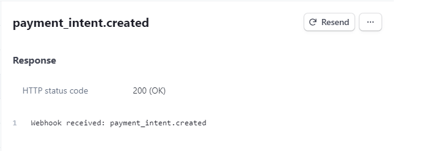
</details>

<details>
<summary>charge.succeeded</summary>
<br>

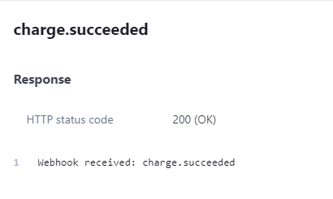
</details>

<details>
<summary>payment_intent.succeeded</summary>
<br>

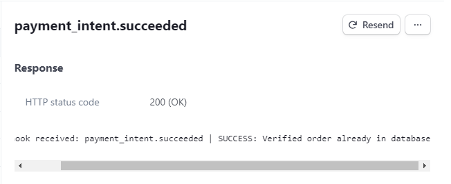
</details>

<details>
<summary>Stripe Logs</summary>
<br>

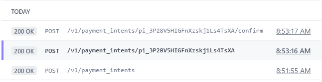
</details>

## Responsiveness Testing

### Browsers 
- Chrome
- Opera
- Bing
- Safari

### Devices
- Lenovo Laptop
- Mac Desktop
- Samsung Phone
- iPhone
- Huawei i7

<details>
<summary>iPad</summary>
<br>


</details>

<details>
<summary>iPhone 12 Pro</summary>
<br>


</details>

<details>
<summary>MacBook Pro</summary>
<br>


</details>

## Bugs

### Fixed Bugs

- **xxx**

- **xxx**

### Known Bugs

- **xxx**